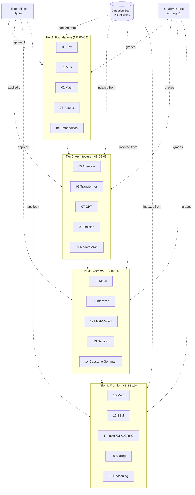
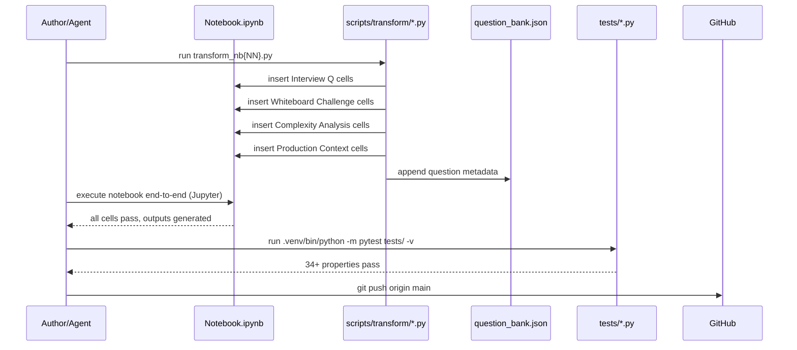

# Design Document: Interview-Grade Notebooks

## Overview

Transform the 20 existing MLX-on-Apple-Silicon notebooks (`00_environment_apple_silicon.ipynb` → `19_reasoning_test_time_compute.ipynb`) from "beginner-friendly tutorials" into a **single coherent interview-prep curriculum** for ML Research Engineer, ML Engineer, and ML Systems Engineer roles at frontier labs (OpenAI, Anthropic, Microsoft, Google DeepMind).

The transformation is **additive and surgical**: every beginner-friendly analogy, visualization, and onboarding ramp stays intact. We layer on top of it four new content strata — **Interview Questions**, **Whiteboard Challenges**, **Systems & Complexity Analysis**, and **Production/Frontier Context** — delivered through a small set of standardized cell templates so reviewers, graders, and readers can navigate the material consistently across all 20 notebooks.

This design is intentionally pragmatic: no new notebooks, no re-architecture of `utils/`, no PyTorch/TensorFlow. All code runs on MLX on Apple Silicon (M4 Pro reference hardware), all property tests under `tests/` continue to pass, and every new code cell is verified by either running inside the notebook or being driven by a Python script in `scripts/transform/`.

## Architecture

### Content Architecture (cross-notebook)



### Transformation Pipeline (per-notebook)



## Components and Interfaces

Each component below is a **concrete, verifiable deliverable** — either a Python module, a JSON schema, or a reusable cell template.

### C1. Cell Template Library (`scripts/transform/templates.py`)

Purpose: Six standardized cell templates, each a pure Python function returning the JSON cell dict ready for `mcp_jupyter_editor_ipynb_insert_cell`.

```python
# scripts/transform/templates.py
from typing import Literal, TypedDict

Difficulty = Literal["warmup", "core", "stretch", "research"]
Role = Literal["mle", "research_engineer", "systems_engineer"]

class InterviewQuestion(TypedDict):
    id: str                      # e.g. "nb05-q03"
    notebook: str                # "05_self_attention.ipynb"
    difficulty: Difficulty
    roles: list[Role]
    question: str                # the prompt
    key_points: list[str]        # 3-7 bullet points the candidate must hit
    trap: str | None             # "what interviewers try to catch you on"
    references: list[str]        # paper URLs / section links

def interview_question_cell(q: InterviewQuestion) -> dict: ...
def whiteboard_challenge_cell(*, title: str, prompt: str,
                              constraints: list[str],
                              solution_code: str,
                              complexity: str) -> dict: ...
def complexity_analysis_cell(*, op: str, flops: str, memory: str,
                             latency_mlx: str, scaling: str) -> dict: ...
def production_context_cell(*, concept: str,
                            vllm: str, sglang: str, trt_llm: str,
                            mlx_lm: str) -> dict: ...
def frontier_context_cell(*, topic: str,
                          papers: list[tuple[str, int, str]],   # (title, year, one-liner)
                          current_sota: str) -> dict: ...
def debugging_failures_cell(*, symptom: str, root_causes: list[str],
                            diagnostic_code: str) -> dict: ...
```

### C2. Quality Rubric (`scripts/transform/rubric.py`)

Scores a notebook on **6 dimensions × 0-10** → total /60. Interview-ready bar is **≥ 48 (80%)** with no dimension < 6.

| Dimension | What it measures |
|---|---|
| Technical Depth | Derivations from first principles, not just formulas |
| Interview Breadth | ≥ 5 interview Qs, ≥ 2 whiteboard challenges, all difficulty tiers covered |
| Systems Rigor | Memory/FLOPs/latency analysis for every major concept |
| Frontier Currency | Citations to 2024-2026 work (DeepSeek-R1, Gemma 4, Claude 3.5, o1/o3) |
| Production Anchoring | Real-deployment tie-ins (vLLM, SGLang, TRT-LLM, MLX-LM) |
| Failure-Mode Literacy | ≥ 1 debugging cell with reproducible symptom → diagnosis |

### C3. Question Bank (`.kiro/specs/interview-grade-notebooks/question_bank.json`)

Single JSON file, one record per interview question, indexed by `id`. Enables cross-notebook navigation, role-filtered mock interviews, and programmatic validation that every question in the notebooks has a paired structured entry.

### C4. Transform Scripts (`scripts/transform/nb{NN}.py`, one per notebook)

Each script is **idempotent** (safe to re-run) and uses the MCP Jupyter notebook tools to insert new cells at stable anchor indices. Re-running reconciles the notebook state with `question_bank.json`.

### C5. Verification Harness (`scripts/transform/verify.py`)

Runs three checks:
1. `jupyter nbconvert --to notebook --execute` on the target notebook (fails on any cell error).
2. `pytest tests/ -v` (must show 34+ passing).
3. `validate_question_bank()` — every Q in the notebooks has a matching entry in `question_bank.json`, and vice versa.

## Data Models

### D1. Question Bank schema

```python
# Pydantic-style, stored as JSON
class InterviewQuestion(BaseModel):
    id: str                       # "nb{NN}-q{NN}"
    notebook: str                 # filename
    section: str                  # markdown heading the Q lives under
    difficulty: Literal["warmup", "core", "stretch", "research"]
    roles: list[Literal["mle", "research_engineer", "systems_engineer"]]
    topic_tags: list[str]         # e.g. ["attention", "memory", "kv-cache"]
    question: str
    answer_key_points: list[str]  # 3-7 items
    worked_solution_cell_id: str | None   # notebook cell id if applicable
    trap: str | None
    references: list[str]
    added_in: str                 # git sha of the transform commit
```

### D2. Complexity Analysis schema

```python
class ComplexityRecord(BaseModel):
    op: str                       # "scaled dot-product attention"
    inputs: dict[str, str]        # {"B":"batch","T":"seq_len","H":"n_heads","D":"d_head"}
    flops: str                    # "O(B·H·T^2·D)"
    memory_bytes: str             # "O(B·H·T^2) for attn matrix + O(B·T·H·D) for QKV"
    latency_mlx_m4pro: dict       # {"seq_len=512": "3.2 ms", "seq_len=2048": "48 ms"}
    bottleneck: Literal["compute", "memory", "memory-bandwidth"]
    scaling_note: str             # "quadratic in T — pathological beyond 8k"
```

### D3. Notebook Transformation Manifest

```python
class NotebookManifest(BaseModel):
    notebook: str
    pedagogy_score_before: float          # from prior review (e.g. 4.2-7.2)
    target_score_after: float             # ≥ 8.0 interview-grade
    questions_to_add: int                 # typically 6-10
    whiteboard_challenges_to_add: int     # typically 2-4
    complexity_cells_to_add: int          # typically 2-5
    production_cells_to_add: int          # typically 1-3
    frontier_cells_to_add: int            # typically 1-3
    debugging_cells_to_add: int           # typically 1-2
    preserve_sections: list[str]          # heading names that must NOT be touched
    anchor_after_headings: list[str]      # headings after which to insert new cells
```

## High-Level Design

### HLD-1. Transformation Framework

Every notebook receives the same five **strata** of additions, in a fixed order so learners build the same mental structure across topics:

| Stratum | Cell Template | Added per notebook | Placement rule |
|---|---|---|---|
| A. Interview Q&A | `interview_question_cell` | 6-10 | After each major concept section |
| B. Whiteboard Challenges | `whiteboard_challenge_cell` | 2-4 | At end of each implementation section |
| C. Complexity & Systems | `complexity_analysis_cell` | 2-5 | Immediately after a new algorithm is introduced |
| D. Production Anchoring | `production_context_cell` | 1-3 | Near the end, after toy implementation |
| E. Frontier Context | `frontier_context_cell` | 1-3 | At end of notebook, before summary |
| F. Debugging & Failures | `debugging_failures_cell` | 1-2 | Alongside relevant algorithm / at notebook tail |

### HLD-2. Notebook Categorization and Per-Tier Emphasis

| Tier | Notebooks | Emphasis |
|---|---|---|
| Foundations | 00-04 | Math rigor (derivatives, linear algebra, information theory), MLX lazy-eval gotchas, tokenizer tradeoffs (BPE/SentencePiece/tiktoken), embedding geometry |
| Architecture | 05-09 | Attention derivations, RoPE vs ALiBi vs NoPE, GQA/MQA memory math, stable training tricks, modern arch choices (LLaMA/Gemma/Mistral) |
| Systems | 10-14 | Metal kernel patterns, roofline analysis, KV-cache memory formulas, FlashAttention tiling, PagedAttention, vLLM/SGLang/TRT-LLM/MLX-LM deployment |
| Frontier | 15-19 | MoE routing math, Mamba/Mamba-2 state updates, DPO/KTO/GRPO derivations, Chinchilla vs Kaplan, o1/o3/R1 test-time compute |

### HLD-3. Interview Question Taxonomy

Every question is tagged with role(s) and difficulty. Mock-interview scripts can filter the bank to produce role-specific study sets.

| Role | Weighted focus |
|---|---|
| ML Engineer (MLE) | Implementation correctness, API design, deployment, debugging |
| Research Engineer (RE) | Derivations, ablations, paper literacy, scaling reasoning |
| ML Systems Engineer (MLSE) | FLOPs/memory/latency, kernels, parallelism, batching, serving |

| Difficulty | Target response time | Example |
|---|---|---|
| warmup | < 2 min | "What's the output shape of softmax over the last dim?" |
| core | 5-10 min | "Derive the DPO loss from the RLHF objective." |
| stretch | 15-20 min | "Implement FlashAttention-1 tiling in MLX." |
| research | open-ended | "Why do SSMs underperform transformers on in-context recall? Propose a fix." |

### HLD-4. Correctness Properties (system-wide)

1. **Executability**: every new code cell runs to completion on MLX on Apple Silicon (M4 Pro, MLX ≥ 0.18).
2. **Test preservation**: `.venv/bin/python -m pytest tests/ -v` shows ≥ 34 passing after every notebook transform.
3. **Q-bank bijection**: ∀ interview Q cell in a notebook ⇔ ∃ matching record in `question_bank.json`.
4. **Whiteboard verifiability**: every whiteboard challenge has a paired solution cell whose output is asserted (e.g., shape check, numerical match against MLX reference).
5. **Complexity faithfulness**: stated FLOPs/memory formulas are corroborated by at least one measured benchmark cell (MLX `mx.eval` + `time.perf_counter`).
6. **Narrative preservation**: all sections listed in `NotebookManifest.preserve_sections` remain byte-identical to pre-transform state.

## Low-Level Design

### LLD-1. Cell Templates (exact markdown/code produced)

**Interview Question cell (markdown):**

```markdown
### 🎯 Interview Question {id}  ·  [{difficulty}]  ·  {roles}

**Q:** {question text}

<details>
<summary>Key points in a strong answer</summary>

- {point 1}
- {point 2}
- ...
</details>

> ⚠️ **Trap:** {common mistake interviewers probe for}
>
> 📚 **References:** {links}
```

**Whiteboard Challenge cell (markdown + paired code cell):**

```markdown
### 🧑‍💻 Whiteboard Challenge: {title}

**Prompt:** {prompt}

**Constraints:**
- {constraint 1}
- {constraint 2}

**Deliverable:** a function with signature `{signature}` that passes the assertions below.

**Expected complexity:** {complexity}
```

```python
# Whiteboard solution (verified)
def solution(...):
    ...

# Assertions
import mlx.core as mx
x = mx.random.normal(shape=(2, 4, 8))
y = solution(x)
mx.eval(y)
assert y.shape == (2, 4, 8), f"shape mismatch: {y.shape}"
# Optional: compare to MLX reference
```

**Complexity Analysis cell (markdown):**

```markdown
### 📐 Complexity & Systems: {op}

| Quantity | Formula | Notes |
|---|---|---|
| FLOPs | `{flops}` | {note} |
| Memory | `{memory}` | {note} |
| Latency (M4 Pro, MLX) | `{measured}` | {seq_len / batch context} |
| Bottleneck | {compute / memory / bandwidth} | {why} |

💡 **Scaling implication:** {one-sentence takeaway}
```

**Production Context cell (markdown):**

```markdown
### 🏭 How Production Systems Handle This

| System | Mechanism | Notes |
|---|---|---|
| vLLM | {mechanism} | {trade-off} |
| SGLang | {mechanism} | {trade-off} |
| TensorRT-LLM | {mechanism} | {trade-off} |
| MLX-LM | {mechanism} | {trade-off} |

🎯 **Interview tip:** {production-flavored takeaway}
```

**Frontier Context cell (markdown):**

```markdown
### 🔭 Frontier Context ({topic})

**Paper trail:**
1. {Title}, {authors}, {year} — {one-line contribution}
2. ...

**Current SOTA ({month-year}):** {summary}

📚 {links}
```

**Debugging & Failure Modes cell (markdown + code):**

```markdown
### 🛠️ Failure Modes & Debugging: {symptom}

**Root causes (ranked by frequency):**
1. {cause 1}
2. {cause 2}

**Diagnostic code:**
```

```python
# Reproduces the symptom, then shows the fix
```

### LLD-2. MLX Implementation Patterns to Showcase

| Pattern | Where | Why it matters for interviews |
|---|---|---|
| Lazy-eval pitfalls | NB 01, 07, 08 | `mx.eval` timing errors are a classic "MLX gotcha" — know when to call it |
| `mx.compile` + `mx.vmap` | NB 08, 11 | Compile closures for hot loops; vmap for batched ops |
| Unified memory zero-copy | NB 10, 13 | Differentiator vs CUDA — CPU/GPU share pointers |
| Metal kernel integration | NB 10, 12 | `mx.fast.metal_kernel` for custom ops (FlashAttention tile kernel) |
| Quantization (`mx.quantize`) | NB 11, 13, 14 | Q4/Q8 trade-offs, dequant-in-kernel |
| KV-cache as `mx.array` | NB 07, 11, 12 | Memory growth formula `2·L·T·H·D·bytes`; paging |
| Mixed precision (`bfloat16`) | NB 08 | Loss scaling, numerical stability |

### LLD-3. Code Patterns (enforced in every new code cell)

```python
# Pattern 1: Shape annotations as comments
x = mx.random.normal(shape=(B, T, D))        # (batch, seq, dim)
y = attention(x, mask)                        # (B, T, D)

# Pattern 2: Assertion blocks at end of whiteboard cells
mx.eval(y)
assert y.shape == (B, T, D), f"got {y.shape}"
assert mx.isfinite(y).all().item(), "NaN/Inf detected"

# Pattern 3: Benchmark pattern
import time
for _ in range(3): mx.eval(f(x))              # warmup
t0 = time.perf_counter()
for _ in range(N): mx.eval(f(x))
dt_ms = (time.perf_counter() - t0) / N * 1000
print(f"{op}: {dt_ms:.2f} ms  ({flops/dt_ms/1e9:.1f} GFLOPS)")

# Pattern 4: Memory measurement
peak_mb = mx.metal.get_peak_memory() / 1e6
```

### LLD-4. Per-Notebook Additions (surgical, keyed to pedagogy scores)

The table below summarizes what each notebook gets. Scripts `scripts/transform/nb{NN}.py` encode these exact counts; any task that bumps a counter must also update the corresponding manifest entry.

| NB | Title | Prev score | Focus of additions |
|----|---|:-:|---|
| 00 | Environment | ~6.5 | Apple Silicon memory model Qs; `mx.metal` API tour; debugging `mx.eval` timing |
| 01 | MLX fundamentals | ~5.5 | Lazy-eval traps, compile graph, shape-broadcasting whiteboards |
| 02 | Math foundations | ~4.5 | Derivations: softmax Jacobian, cross-entropy gradient, KL properties; matrix calc Qs |
| 03 | Tokenization | ~5.0 | BPE vs SentencePiece vs tiktoken trade-offs; tokenizer leakage traps; vocab-size math |
| 04 | Embeddings & PE | ~5.5 | RoPE derivation; ALiBi slopes; context-extension Qs (YaRN, NTK-aware) |
| 05 | Self-attention | ~6.5 | Softmax-scaling derivation; causal mask whiteboard; memory formula for attn matrix |
| 06 | Transformer | ~6.5 | Pre-norm vs post-norm; parameter count formulas; residual scaling Qs |
| 07 | Building GPT | ~7.0 | KV-cache memory growth; generation-strategies (greedy/top-k/top-p/beam) challenges |
| 08 | Training | ~7.0 | LR schedules (cosine/warmup) Qs; grad clipping; mixed-precision / loss scaling |
| 09 | Modern architectures | ~6.5 | LLaMA vs Gemma vs Mistral table; GQA/MQA memory math; SwiGLU vs GeGLU |
| 10 | Metal kernels | ~5.5 | Kernel launch overhead; shared-memory tiling; roofline plots for M4 Pro |
| 11 | Inference opt | ~7.2 | Prefill vs decode FLOPs; speculative decoding math; quant error bounds |
| 12 | Flash / Paged / Ring | ~7.0 | FA-1/FA-2 tile math; block-table paging; ring-attention partitioning |
| 13 | Serving | ~6.5 | Continuous batching; vLLM scheduler Qs; SLO math (p50/p99 latency) |
| 14 | Capstone Gemma 4 | ~7.0 | Full-stack debugging challenge; production readiness checklist |
| 15 | MoE | ~6.0 | Top-k routing math; load-balancing loss; expert-parallel memory |
| 16 | SSM | ~5.5 | Mamba recurrence derivation; selective-scan FLOPs; Transformer-vs-SSM benchmark |
| 17 | Alignment | ~7.0 | DPO → KTO → GRPO derivations; reward hacking debugging; β sensitivity |
| 18 | Scaling laws | ~7.2 | Chinchilla optimization problem; Kaplan debate; inference-optimal vs compute-optimal |
| 19 | Reasoning / TTC | ~6.5 | CoT vs ToT; o1/o3/R1 test-time compute math; verifier-guided search |

### LLD-5. Integration with Existing Notebook Structure

1. **Never delete beginner content.** Scripts operate via either `mcp_jupyter_editor_ipynb_insert_cell` or direct JSON-level cell-list insertions at explicit indices; no `delete_cell` or `replace_cell` unless listed under `preserve_sections = []` override (rare, documented in the manifest). Requirement 19.4 permits either mechanism as long as the resulting notebook is nbformat-valid and executes green.
2. **Anchor by heading, not by index.** Transform scripts first search for the markdown heading (`search_cells`), then insert *after* the matched index. This survives future edits.
3. **Visual separators.** New strata cells are separated from beginner prose by a `---` cell and prefixed with the emoji key (🎯 🧑‍💻 📐 🏭 🔭 🛠️) so readers can scan for the interview layer without losing the beginner flow.
4. **Summary index cell.** Every notebook gets a new end-of-notebook cell titled `### 📋 Interview Question Index` listing all Qs with anchors — auto-regenerated from `question_bank.json`.

### LLD-6. Execution & Verification (automated, Python-script driven)

**Mandatory: no inline Python in the CLI.** All execution flows through scripts.

```bash
# one-shot per notebook (runs transform → execute → pytest → commit)
.venv/bin/python scripts/transform/run_pipeline.py --notebook 05 --push

# batch (respects parallelism rules; 10 max at once)
.venv/bin/python scripts/transform/run_pipeline.py --all --parallel 10 --push
```

`run_pipeline.py` delegates to:
- `scripts/transform/nb{NN}.py` — notebook-specific additions
- `scripts/transform/verify.py` — executes notebook + pytest + Q-bank bijection check
- `scripts/transform/commit.py` — stages diff, commits with conventional message, pushes to `origin main`

## Correctness Properties

*A property is a characteristic or behavior that should hold true across all valid executions of a system — essentially, a formal statement about what the system should do. Properties serve as the bridge between human-readable specifications and machine-verifiable correctness guarantees.*

### Property 1: Interview Coverage Floors and Spread

*For any* transformed Notebook, the Notebook contains at least 6 Interview Question cells, at least 2 Whiteboard Challenge cells, at least 2 Complexity Analysis cells, and at least 1 Production Context / Frontier Context / Debugging cell; the Notebook's Interview Question cells collectively cover all four difficulty tiers (`warmup`, `core`, `stretch`, `research`) and all three roles (`mle`, `research_engineer`, `systems_engineer`).

**Validates: Requirements 1.1, 1.2, 1.3, 1.4, 1.5, 1.6, 1.7, 1.8**

### Property 2: Tier-Specific Topic Emphasis

*For any* Notebook in a given tier, the interview-layer cells include topic tags corresponding to that tier's emphasis (Foundations → math/MLX/tokenizer/embeddings; Architecture → attention/PE/GQA/modern-arch; Systems → Metal/KV-cache/FlashAttention/PagedAttention; Frontier → 2024–2026 works); *for any* Production Context cell the cell references at least three of {vLLM, SGLang, TensorRT-LLM, MLX-LM}.

**Validates: Requirements 2.1, 2.2, 2.3, 2.4, 2.5**

### Property 3: Question Bank Schema Validity

*For any* record in the Question_Bank, the record contains all required fields (`id`, `notebook`, `section`, `difficulty`, `roles`, `topic_tags`, `question`, `answer_key_points`, `worked_solution_cell_id`, `trap`, `references`, `added_in`), the `id` matches the pattern `nb{NN}-q{NN}`, the `difficulty` is in `{warmup, core, stretch, research}`, the `roles` is a non-empty subset of `{mle, research_engineer, systems_engineer}`, and `answer_key_points` has between 3 and 7 items inclusive.

**Validates: Requirements 3.2, 3.3, 3.4, 3.5, 3.6**

### Property 4: Question Bank Bijection

*For any* Interview Question cell in any Notebook there exists exactly one Question_Bank record whose `id` matches, and *for any* Question_Bank record there exists exactly one Interview Question cell in the referenced Notebook whose id matches; i.e. the id mapping is a bijection.

**Validates: Requirements 3.7, 3.8**

### Property 5: Role Filter Correctness

*For any* Question_Bank record `r` and role `R`, filtering the Question_Bank by role `R` returns `r` if and only if `R` is contained in `r.roles`.

**Validates: Requirements 3.9, 17.2**

### Property 6: Whiteboard Verifiability

*For any* Whiteboard Challenge cell in any Notebook, the immediately-following cell is a code cell containing at least one `assert` statement and at least one call to `mx.eval` before any host-side value read; the solution cell executes to completion on MLX on Apple Silicon without raising an exception.

**Validates: Requirements 4.1, 4.2, 4.3, 4.4, 7.5**

### Property 7: Complexity Cell Faithfulness

*For any* Complexity Analysis cell in any Notebook, there exists a paired benchmark code cell in the same Notebook that uses `time.perf_counter` and `mx.eval` with at least 3 warmup iterations; the Complexity Analysis cell declares FLOPs, memory, measured latency, and bottleneck classification; *for any* Complexity Analysis cell in a Systems-tier Notebook, measurements are reported at no fewer than two distinct sequence-length or batch-size points.

**Validates: Requirements 5.1, 5.2, 5.3, 5.4, 5.5**

### Property 8: Narrative Preservation

*For any* cell listed in a Notebook's `preserve_sections` manifest entry, the post-transform cell content is byte-identical to the pre-transform content; *for any* new interview-layer cell, the preceding cell is a `---` separator cell (unless the new cell is itself a continuation of an interview-layer block).

**Validates: Requirements 6.1, 6.2, 6.3, 6.5**

### Property 9: MLX-Only New Code

*For any* new code cell inserted by the pipeline, the cell does not import `torch`, `tensorflow`, or `jax`.

**Validates: Requirement 7.4**

### Property 10: Transform Idempotence

*For any* Notebook and any Transform_Script, running the Transform_Script twice in succession produces a Notebook byte-identical to the single-run output; *for any* interrupted transform, re-running the script completes the transform without duplicating cells.

**Validates: Requirements 10.1, 10.2, 10.3, 10.4, 21.4**

### Property 11: Concurrent Q-Bank Write Safety

*For any* set of up to 10 concurrent Transform_Script invocations on distinct Notebooks, the resulting Question_Bank remains schema-valid (Property 3) and each transform writes only to its own `nb{NN}-q*` key-space; no writes from one transform are lost or overwritten by another.

**Validates: Requirements 12.2, 12.3**

### Property 12: Cell Template Consistency

*For any* cell of a given stratum in any Notebook, the cell's content begins with the stratum's emoji prefix (🎯 for Interview Question, 🧑‍💻 for Whiteboard Challenge, 📐 for Complexity Analysis, 🏭 for Production Context, 🔭 for Frontier Context, 🛠️ for Debugging); *for any* transformed Notebook, there is exactly one end-of-notebook cell titled `📋 Interview Question Index`.

**Validates: Requirements 20.1, 20.2, 20.3, 20.4, 20.5, 20.6, 20.7**

### Property 13: Hypothesis Iteration Floor

*For any* new property-based test added under `tests/test_interview_grade_properties.py`, the test's `@settings` declares `max_examples` of at least 100.

**Validates: Requirement 9.5**

### Property 14: Pipeline Commit Metadata

*For any* commit produced by the pipeline, the commit message matches a pattern that references the notebook number and transform stage; *for any* Question_Bank record added by the pipeline, the `added_in` field contains a valid Git SHA of the commit that introduced it.

**Validates: Requirements 16.3, 16.4**

### Property 15: Curriculum Completeness and Quality Threshold

*For any* notebook number N in {00, 01, …, 19}, the corresponding Notebook has been transformed, has a persisted Pedagogy_Reviewer review at `.kiro/specs/interview-grade-notebooks/reviews/nb{NN}.md`, scores at least 48/60 on the Quality_Rubric, and scores at least 6/10 on every individual Quality_Rubric dimension.

**Validates: Requirements 13.4, 14.1, 14.2, 15.1**

### Property 16: No Inline Python in Pipeline

*For any* shell invocation referenced by `scripts/transform/run_pipeline.py` or its documented usage, the invocation does not pass Python code via the `-c` flag; all execution flows through `.py` files under `scripts/transform/`.

**Validates: Requirement 11.3**

---

### Tests backed by these properties (sketch)

```python
# tests/test_interview_grade_properties.py (to be added)

def test_coverage_floors_and_spread():              # Property 1
def test_tier_specific_emphasis():                  # Property 2
def test_question_bank_schema():                    # Property 3
def test_question_bank_bijection():                 # Property 4
def test_role_filter_correctness():                 # Property 5
def test_whiteboard_verifiability():                # Property 6
def test_complexity_cell_faithfulness():            # Property 7
def test_narrative_preservation():                  # Property 8
def test_mlx_only_new_code():                       # Property 9
def test_transform_idempotence():                   # Property 10
def test_concurrent_qbank_write_safety():           # Property 11
def test_cell_template_consistency():               # Property 12
def test_hypothesis_iteration_floor():              # Property 13
def test_pipeline_commit_metadata():                # Property 14
def test_curriculum_completeness_and_quality():     # Property 15
def test_no_inline_python_in_pipeline():            # Property 16
```

### Integration / smoke checks (not property-based)

- Notebook end-to-end execution via `jupyter nbconvert --execute` on each of the 20 notebooks (Requirement 7.1) — integration, 1 run per notebook.
- `pytest tests/ -v` reports ≥ 34 passing after each transform (Requirement 8.2) — integration.
- Pipeline aborts before commit on test failure (Requirement 8.3) — example-based test with synthetic failing test.
- Q-Bank bijection drift reports unmatched ids (Requirement 21.2) — example-based test.
- Absence of a standalone `READING_PATHS.md` file (Requirement 17.3, 18.2) — smoke.

## Error Handling

| Scenario | Response | Recovery |
|---|---|---|
| Notebook cell fails during `nbconvert --execute` | `verify.py` exits non-zero, prints failing cell index | Fix cell; re-run pipeline (idempotent) |
| Pytest regression after transform | `run_pipeline.py` aborts before commit | Roll back notebook (git checkout), inspect diff |
| Q-bank drift (Q in notebook missing from JSON, or vice versa) | Bijection test fails | Re-run `nb{NN}.py` (rebuilds Q-bank slice) |
| MLX OOM on M4 Pro during whiteboard execution | Solution cell wrapped in `try/except`, prints peak memory | Lower batch/seq in challenge; update complexity cell to match |
| Merge conflict in `question_bank.json` across parallel agents | `run_pipeline.py` uses file lock + per-notebook key-spaces (`nb05-q*`) | Retry with exponential backoff |

## Testing Strategy

**Unit (scripts)**: Each template function in `templates.py` has a unit test producing exact expected JSON.

**Property-based (hypothesis)**: existing 34 tests remain; new properties added for Q-bank bijection, whiteboard verifiability, complexity faithfulness.

**Integration**: `verify.py` runs each transformed notebook end-to-end via `jupyter nbconvert --to notebook --execute --inplace` then checks outputs.

**Visual review**: `pedagogy-reviewer` and `notebook-reviewer` sub-agents re-score each transformed notebook against the rubric; target ≥ 48/60 with no dim < 6.

## Performance Considerations

- Batch transformations across notebooks in **parallel up to 10 agents** (per user directive).
- Notebook execution is the slow link (~1-5 min per notebook); parallelize at the notebook level, serialize within.
- `question_bank.json` uses per-notebook key-spaces (`nb{NN}-q{NN}`) so parallel writers don't collide.

## Security / Risk Considerations

- No secrets embedded. Benchmark numbers are hardware-specific (M4 Pro) and labeled as such.
- External paper links go to arXiv or official lab blogs only.
- No scraping of proprietary interview questions; all questions are synthesized from first principles and public papers.

## Dependencies

- MLX ≥ 0.18 (Apple Silicon)
- Jupyter + `nbconvert`
- `pytest` + `hypothesis`
- MCP Jupyter notebook tools (`mcp_jupyter_editor_ipynb_*`) for programmatic cell edits
- `.venv/bin/python` for all script execution
- Git + GitHub remote `https://github.com/stabgan/LLM-Notebooks.git`

## Open Questions (Resolved in Requirements Phase)

The four questions originally opened in this design have been resolved by the requirements document (`requirements.md`):

1. **Rubric threshold** → ≥ 48/60 (80%) with no dimension below 6/10 (Requirements 14.1, 14.2).
2. **Mock-interview script** → Out of scope; deferred to follow-up feature (Requirement 18.1).
3. **Role-filtered reading paths** → Expressed via Question_Bank filters only; no standalone `READING_PATHS.md` (Requirements 17.1, 17.3, 18.2).
4. **Pedagogy re-review** → Run on all 20 notebooks via parallel sub-agents, not a sample (Requirements 13.1, 13.2, 13.3).
