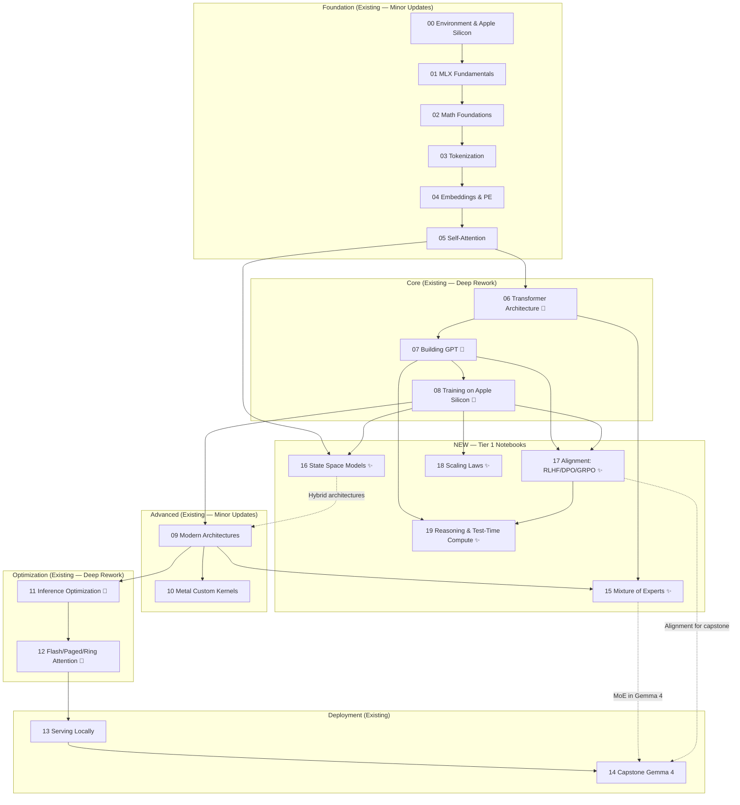
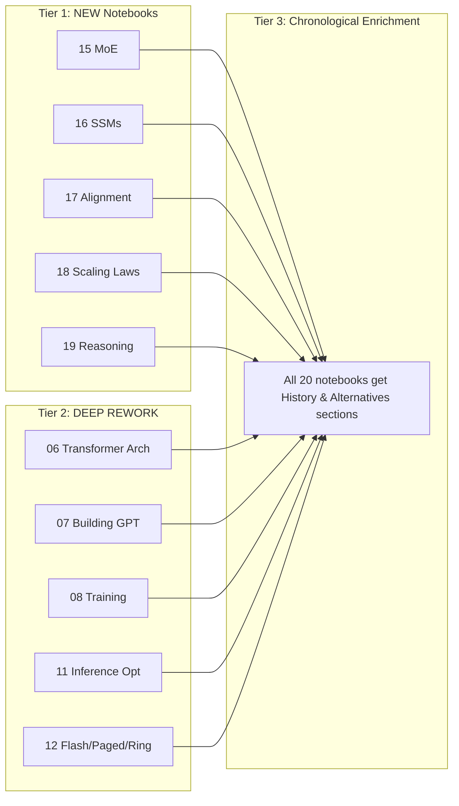
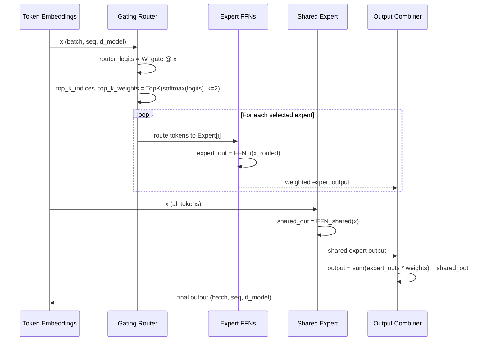
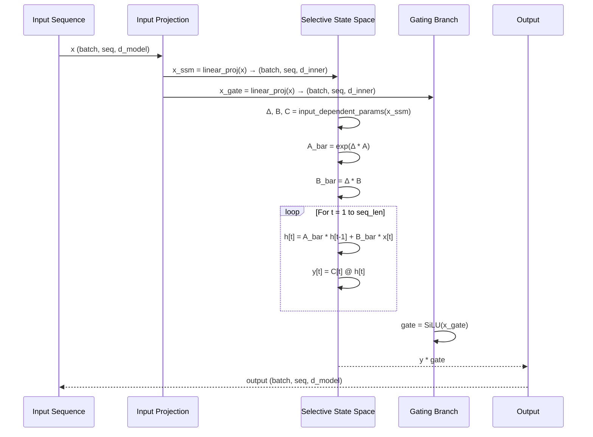
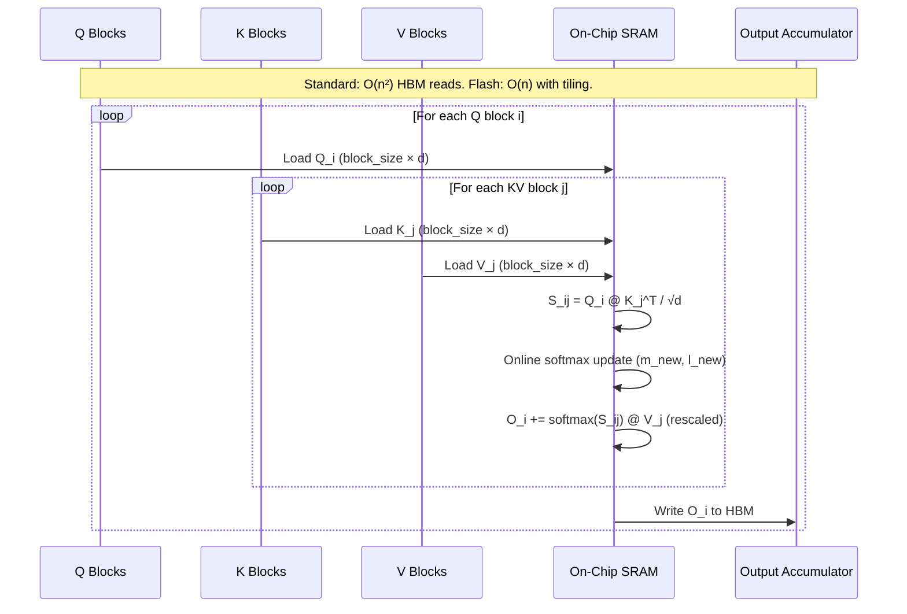

# Design Document: LLM Deep-Dive Enhancement

## Overview

This enhancement transforms the existing 15-notebook LLM learning series into a 20-notebook deep-dive curriculum targeting AI lab interview readiness at Google DeepMind, OpenAI, Anthropic, and Apple ML by April 2026. The current series covers fundamentals well but lacks depth in five critical areas that dominate modern AI research: Mixture of Experts (MoE), State Space Models (SSMs), alignment techniques (RLHF/DPO/GRPO), scaling laws, and reasoning/test-time compute. Additionally, five existing notebooks (06, 07, 08, 11, 12) require deep rework to bring their implementations from shallow overviews to interview-grade depth.

The enhancement follows a three-tier strategy. Tier 1 adds five completely new notebooks (15–19) covering the missing topics with full math derivations, MLX implementations, and comparative analysis. Tier 2 deeply reworks five existing notebooks to include complete training loops, formal gradient analysis, full algorithm implementations, and production-grade error handling. Tier 3 enriches every notebook with chronological "History & Alternatives" sections that trace the evolution of each major component from its origin to the 2025 state of the art.

All code uses MLX exclusively on Apple Silicon (M4 Pro, 48GB unified memory). Every concept follows the pedagogical pattern: math derivation → step-by-step code → visualization → comparison. Memory usage stays under 20GB during any single notebook execution. The mentor/coach style uses emoji markers (💡 insights, ⚡ performance, 🎯 interview tips, ⚠️ pitfalls) throughout.

## Architecture

### Enhanced Notebook Dependency Graph



### Tier Classification



## Sequence Diagrams

### MoE Forward Pass (Notebook 15)



### Mamba Selective Scan (Notebook 16)



### DPO Training Loop (Notebook 17)

```mermaid
sequenceDiagram
    participant Data as Preference Dataset
    participant Policy as Policy Model (πθ)
    participant Ref as Reference Model (πref)
    participant Loss as DPO Loss
    participant Opt as Optimizer

    Data->>Policy: (prompt, chosen, rejected)
    Data->>Ref: (prompt, chosen, rejected)
    
    Policy->>Policy: log_π_chosen = log_prob(chosen | prompt)
    Policy->>Policy: log_π_rejected = log_prob(rejected | prompt)
    Ref->>Ref: log_πref_chosen = log_prob(chosen | prompt)
    Ref->>Ref: log_πref_rejected = log_prob(rejected | prompt)
    
    Policy-->>Loss: log ratios
    Ref-->>Loss: log ratios
    
    Loss->>Loss: reward_chosen = β * (log_π_chosen - log_πref_chosen)
    Loss->>Loss: reward_rejected = β * (log_π_rejected - log_πref_rejected)
    Loss->>Loss: loss = -log(σ(reward_chosen - reward_rejected))
    
    Loss->>Opt: backward(loss)
    Opt->>Policy: update parameters
```

### Flash Attention Tiled Computation (Notebook 12 Rewrite)



## Components and Interfaces

### Tier 1: New Notebook Components

#### Notebook 15: Mixture of Experts

**Purpose**: Teach MoE architecture from first principles through modern implementations (Mixtral, DeepSeek-V3, Gemma 4).

```pascal
STRUCTURE MoEConfig
  d_model: Integer          { Model dimension }
  num_experts: Integer      { Total number of experts (e.g., 8) }
  num_active: Integer       { Experts active per token (e.g., 2) }
  d_ff: Integer             { FFN hidden dimension per expert }
  has_shared_expert: Boolean { Whether to use shared expert (Gemma 4 style) }
  load_balance_weight: Float { Auxiliary loss weight (e.g., 0.01) }
END STRUCTURE

INTERFACE MoERouter
  PROCEDURE route(x: Tensor[batch, seq, d_model]) -> (indices: Tensor[batch, seq, k], weights: Tensor[batch, seq, k])
  PROCEDURE compute_load_balance_loss(router_logits: Tensor) -> Float
END INTERFACE

INTERFACE ExpertFFN
  PROCEDURE forward(x: Tensor[batch, seq, d_model]) -> Tensor[batch, seq, d_model]
END INTERFACE

INTERFACE MoEBlock
  PROCEDURE forward(x: Tensor[batch, seq, d_model]) -> (output: Tensor[batch, seq, d_model], aux_loss: Float)
END INTERFACE
```

**Responsibilities**:
- Implement Top-K, Expert Choice, and Hash routing mechanisms
- Implement load balancing auxiliary loss to prevent expert collapse
- Implement shared expert concept (Gemma 4, DeepSeek-V3)
- Provide memory analysis comparing MoE vs dense models
- Trace chronological evolution: Dense → Switch Transformer → Mixtral → DeepSeek-V3 → Gemma 4

#### Notebook 16: State Space Models

**Purpose**: Teach SSMs as an alternative to attention, from S4 through Mamba to hybrid architectures.

```pascal
STRUCTURE SSMConfig
  d_model: Integer       { Model dimension }
  d_state: Integer       { SSM state dimension (e.g., 16) }
  d_inner: Integer       { Inner dimension after expansion }
  expand_factor: Integer { Expansion factor (e.g., 2) }
  dt_rank: Integer       { Rank of Δ projection }
END STRUCTURE

INTERFACE SimpleSSM
  PROCEDURE discretize(A: Matrix, B: Matrix, delta: Tensor) -> (A_bar: Matrix, B_bar: Matrix)
  PROCEDURE scan(A_bar: Matrix, B_bar: Matrix, C: Matrix, x: Tensor) -> Tensor
END INTERFACE

INTERFACE SelectiveSSM
  PROCEDURE forward(x: Tensor[batch, seq, d_inner]) -> Tensor[batch, seq, d_inner]
  { Δ, B, C are input-dependent (selective) }
END INTERFACE

INTERFACE MambaBlock
  PROCEDURE forward(x: Tensor[batch, seq, d_model]) -> Tensor[batch, seq, d_model]
  { Includes: input projection, conv1d, selective SSM, gating, output projection }
END INTERFACE
```

**Responsibilities**:
- Explain why attention is O(n²) and motivate alternatives
- Implement simple SSM from scratch with discretization
- Implement Mamba-style selective scan
- Compare attention vs SSM on complexity, memory, and quality
- Cover: Linear Attention, S4, Mamba, Mamba-2, RWKV-6, Griffin, Jamba

#### Notebook 17: Alignment (RLHF, DPO, GRPO)

**Purpose**: Teach how base models become helpful assistants through alignment techniques.

```pascal
STRUCTURE PreferenceDataPoint
  prompt: String
  chosen_response: String
  rejected_response: String
END STRUCTURE

STRUCTURE RewardModelConfig
  base_model: TransformerConfig
  reward_head: Linear { Maps d_model -> 1 }
END STRUCTURE

INTERFACE RewardModel
  PROCEDURE forward(input_ids: Tensor[batch, seq]) -> Tensor[batch, 1]
  PROCEDURE compute_reward(prompt: String, response: String) -> Float
END INTERFACE

INTERFACE DPOTrainer
  PROCEDURE compute_log_probs(model: LLM, input_ids: Tensor, labels: Tensor) -> Tensor
  PROCEDURE dpo_loss(policy: LLM, reference: LLM, batch: PreferenceDataPoint) -> Float
  PROCEDURE train_step(batch: PreferenceDataPoint) -> Float
END INTERFACE

INTERFACE GRPOTrainer
  PROCEDURE sample_group(model: LLM, prompt: String, n: Integer) -> List[String]
  PROCEDURE compute_group_rewards(responses: List[String]) -> Tensor
  PROCEDURE grpo_loss(model: LLM, prompt: String, group_size: Integer) -> Float
END INTERFACE
```

**Responsibilities**:
- Explain SFT → RLHF → DPO → KTO → GRPO progression
- Implement simple reward model in MLX
- Implement DPO training loop in MLX
- Compare RLHF vs DPO vs GRPO on complexity, data requirements, quality
- Cover Constitutional AI (Anthropic) concept

#### Notebook 18: Scaling Laws & Compute-Optimal Training

**Purpose**: Teach how to predict model performance and choose optimal training configurations.

```pascal
STRUCTURE ScalingLawParams
  alpha_N: Float  { Exponent for model size scaling }
  alpha_D: Float  { Exponent for data size scaling }
  A: Float        { Coefficient for model size term }
  B: Float        { Coefficient for data size term }
  E: Float        { Irreducible loss (entropy of natural language) }
END STRUCTURE

STRUCTURE ComputeBudget
  total_flops: Float       { Total compute in FLOPs }
  optimal_N: Integer       { Optimal model parameters }
  optimal_D: Integer       { Optimal training tokens }
  estimated_loss: Float    { Predicted loss at optimum }
END STRUCTURE

INTERFACE ScalingLawPredictor
  PROCEDURE predict_loss(N: Integer, D: Integer) -> Float
  PROCEDURE compute_optimal_allocation(C: Float) -> ComputeBudget
  PROCEDURE estimate_training_flops(N: Integer, D: Integer) -> Float
END INTERFACE
```

**Responsibilities**:
- Implement Kaplan and Chinchilla scaling law formulas
- Visualize power-law relationships with log-log plots
- Build compute budget calculator
- Discuss emergent abilities debate
- Provide practical guidance: given X compute, what's optimal?

#### Notebook 19: Reasoning & Test-Time Compute

**Purpose**: Teach how models reason and how test-time compute scaling improves answers.

```pascal
STRUCTURE ReasoningConfig
  max_reasoning_steps: Integer  { Maximum CoT steps }
  num_samples: Integer          { For self-consistency }
  branching_factor: Integer     { For tree search }
  temperature: Float            { Sampling temperature }
END STRUCTURE

INTERFACE CoTPromptPipeline
  PROCEDURE generate_with_cot(model: LLM, prompt: String) -> (reasoning: String, answer: String)
  PROCEDURE self_consistency(model: LLM, prompt: String, n: Integer) -> String
END INTERFACE

INTERFACE MCTSReasoner
  PROCEDURE expand(node: ReasoningNode) -> List[ReasoningNode]
  PROCEDURE evaluate(node: ReasoningNode) -> Float
  PROCEDURE search(prompt: String, budget: Integer) -> String
END INTERFACE

INTERFACE ProcessRewardModel
  PROCEDURE score_step(reasoning_step: String, context: String) -> Float
  PROCEDURE score_trajectory(steps: List[String]) -> List[Float]
END INTERFACE
```

**Responsibilities**:
- Implement CoT prompting pipeline
- Implement self-consistency with majority voting
- Implement simple MCTS-style reasoning search
- Explain process vs outcome reward models
- Cover: CoT, Self-Consistency, ToT, o1-style reasoning, DeepSeek-R1

### Tier 2: Deep Rework Components

#### Notebook 06: Transformer Architecture — Deep Rework

**What Changes**: Shallow component assembly → deep analysis with backpropagation walkthrough, activation/normalization comparisons, and parameter counting.

**New Interfaces**:

```pascal
INTERFACE ActivationComparison
  PROCEDURE compare_activations(x: Tensor) -> Dict[String, Tensor]
  { Returns outputs for: ReLU, GELU, SiLU, SwiGLU, GeGLU }
  PROCEDURE plot_activation_landscape(activations: Dict) -> Plot
END INTERFACE

INTERFACE NormalizationComparison
  PROCEDURE compare_norms(x: Tensor) -> Dict[String, Tensor]
  { Returns outputs for: BatchNorm, LayerNorm, RMSNorm, DeepNorm }
  PROCEDURE gradient_flow_analysis(model: TransformerStack, depth: Integer) -> Plot
END INTERFACE

INTERFACE ParameterCounter
  PROCEDURE count_params(config: TransformerConfig) -> Dict[String, Integer]
  { Returns per-component breakdown: attention, FFN, norm, embedding, total }
  PROCEDURE estimate_memory(config: TransformerConfig, dtype: DType) -> Dict[String, Float]
END INTERFACE
```

**New Content**:
- Complete backpropagation walkthrough through a transformer block
- Activation comparison with plots: ReLU → GELU → SiLU → SwiGLU → GeGLU
- Normalization comparison: BatchNorm → LayerNorm → RMSNorm → DeepNorm
- Pre-norm vs post-norm gradient flow analysis
- Parameter counting formulas for any transformer config
- Weight initialization strategies (Xavier, Kaiming, etc.)

#### Notebook 07: Building GPT — Deep Rework

**What Changes**: Minimal training on inline text → full training pipeline with tiny_shakespeare, proper LR scheduling, checkpointing, and evaluation.

**New Interfaces**:

```pascal
INTERFACE TrainingPipeline
  PROCEDURE download_dataset(name: String) -> (train: TextDataset, val: TextDataset)
  PROCEDURE cosine_lr_schedule(step: Integer, warmup: Integer, max_steps: Integer, max_lr: Float, min_lr: Float) -> Float
  PROCEDURE train_step(model: GPT, batch: Batch, optimizer: Optimizer) -> (loss: Float, grad_norm: Float)
  PROCEDURE evaluate(model: GPT, val_data: TextDataset) -> (val_loss: Float, perplexity: Float)
END INTERFACE

INTERFACE CheckpointManager
  PROCEDURE save(model: GPT, optimizer: Optimizer, step: Integer, path: String) -> None
  PROCEDURE load(path: String) -> (model: GPT, optimizer: Optimizer, step: Integer)
  PROCEDURE save_best(model: GPT, val_loss: Float) -> None
END INTERFACE

INTERFACE NaNRecovery
  PROCEDURE detect_nan(loss: Float) -> Boolean
  PROCEDURE recover(model: GPT, checkpoint: String, new_lr: Float) -> GPT
END INTERFACE
```

**New Content**:
- Download and use tiny_shakespeare dataset
- Full training loop with cosine LR schedule + warmup
- Gradient clipping implementation
- Checkpoint saving and loading
- Proper evaluation loop with validation perplexity
- Generation samples at different training stages (step 0, 100, 500, 1000)
- NaN/Inf detection with automatic recovery

#### Notebook 08: Training on Apple Silicon — Deep Rework

**What Changes**: Conceptual explanations → actual working implementations of gradient accumulation, mixed precision, memory profiling, and OOM recovery.

**New Interfaces**:

```pascal
INTERFACE GradientAccumulator
  PROCEDURE accumulate(model: nn.Module, batch: Batch, accum_steps: Integer) -> (loss: Float, grads: Dict)
  { Actually accumulates gradients over micro-batches }
END INTERFACE

INTERFACE MixedPrecisionTrainer
  PROCEDURE train_step_bf16(model: nn.Module, batch: Batch) -> (loss: Float, memory: Integer)
  PROCEDURE compare_dtypes(model: nn.Module, batch: Batch) -> Dict[String, Metrics]
  { Compares float32 vs float16 vs bfloat16 on speed, memory, loss stability }
END INTERFACE

INTERFACE MemoryProfiler
  PROCEDURE profile_training_step(model: nn.Module, batch: Batch) -> MemoryTimeline
  PROCEDURE plot_memory_timeline(timeline: MemoryTimeline) -> Plot
  PROCEDURE detect_oom() -> Boolean
  PROCEDURE auto_reduce_batch_size(current_batch: Integer) -> Integer
END INTERFACE

INTERFACE MemoryBudgetCalculator
  PROCEDURE compute_budget(config: TransformerConfig, batch_size: Integer, seq_len: Integer) -> MemoryBreakdown
  PROCEDURE plot_stacked_bar(breakdown: MemoryBreakdown) -> Plot
END INTERFACE
```

**New Content**:
- Full gradient accumulation implementation (actual training loop)
- Actual bfloat16 mixed precision training comparison
- Memory profiling during training with real-time plots
- OOM recovery with automatic batch size reduction
- mx.compile() with actual training step benchmarks
- Full MemoryBudget calculator with stacked bar chart visualization

#### Notebook 11: Inference Optimization — Deep Rework

**What Changes**: Conceptual KV-cache and quantization → full implementations with benchmarks and perplexity comparisons.

**New Interfaces**:

```pascal
INTERFACE KVCacheManager
  PROCEDURE prefill(model: GPT, prompt_ids: Tensor) -> (logits: Tensor, cache: KVCache)
  PROCEDURE decode_step(model: GPT, token_id: Integer, cache: KVCache) -> (logits: Tensor, cache: KVCache)
  PROCEDURE memory_usage(cache: KVCache) -> Integer
END INTERFACE

INTERFACE Quantizer
  PROCEDURE quantize_4bit(weights: Tensor, group_size: Integer) -> QuantizedTensor
  PROCEDURE quantize_8bit(weights: Tensor, group_size: Integer) -> QuantizedTensor
  PROCEDURE dequantize(qweights: QuantizedTensor) -> Tensor
  PROCEDURE measure_perplexity(model: GPT, data: TextDataset) -> Float
END INTERFACE

INTERFACE SpeculativeDecoder
  PROCEDURE draft(draft_model: GPT, prompt: Tensor, n_draft: Integer) -> Tensor
  PROCEDURE verify(target_model: GPT, draft_tokens: Tensor) -> (accepted: Tensor, n_accepted: Integer)
  PROCEDURE generate(prompt: Tensor, max_tokens: Integer) -> (tokens: Tensor, acceptance_rate: Float)
END INTERFACE
```

**New Content**:
- Full KV-cache implementation with prefill and decode phases
- Actual 4-bit and 8-bit quantization with perplexity comparison
- Full speculative decoding implementation with draft/target models
- Continuous batching concept explanation
- GPTQ, AWQ, GGUF format explanations

#### Notebook 12: Flash/Paged/Ring Attention — Complete Rewrite

**What Changes**: Shallow conceptual overview → full algorithm derivations and implementations.

**New Interfaces**:

```pascal
INTERFACE OnlineSoftmax
  PROCEDURE online_softmax_update(m_prev: Float, l_prev: Float, S_new: Tensor) -> (m_new: Float, l_new: Float, P_new: Tensor)
  { The core algorithm that makes Flash Attention possible }
END INTERFACE

INTERFACE FlashAttention
  PROCEDURE tiled_attention(Q: Tensor, K: Tensor, V: Tensor, block_size: Integer) -> Tensor
  PROCEDURE memory_analysis(seq_len: Integer, d_model: Integer) -> (standard_mem: Integer, flash_mem: Integer)
END INTERFACE

INTERFACE PagedAttention
  STRUCTURE Block
    key_cache: Tensor[block_size, num_heads, head_dim]
    value_cache: Tensor[block_size, num_heads, head_dim]
  END STRUCTURE
  
  PROCEDURE allocate_block() -> Block
  PROCEDURE free_block(block: Block) -> None
  PROCEDURE append_token(token_kv: Tuple, block_table: List[Block]) -> None
  PROCEDURE read_kv(block_table: List[Block], positions: Range) -> (K: Tensor, V: Tensor)
END INTERFACE

INTERFACE RingAttention
  PROCEDURE ring_step(Q_local: Tensor, K_remote: Tensor, V_remote: Tensor, acc: Tensor) -> Tensor
  PROCEDURE simulate_ring(Q: Tensor, K: Tensor, V: Tensor, num_devices: Integer) -> Tensor
END INTERFACE
```

**New Content**:
- Full online softmax algorithm derivation (the math that makes Flash Attention work)
- Step-by-step tiled attention implementation in MLX
- Memory analysis: standard O(n²) vs Flash O(n) with actual numbers
- Paged Attention: full block manager implementation
- Ring Attention: distributed simulation across virtual devices
- Benchmark: standard vs Flash attention at different sequence lengths

## Data Models

### Core Data Structures

```pascal
{ === Shared across all notebooks === }

STRUCTURE TransformerConfig
  d_model: Integer        { Model dimension (e.g., 768) }
  n_heads: Integer        { Number of attention heads (e.g., 12) }
  n_kv_heads: Integer     { Number of KV heads for GQA (e.g., 4) }
  n_layers: Integer       { Number of transformer blocks (e.g., 12) }
  d_ff: Integer           { FFN hidden dimension (e.g., 3072) }
  vocab_size: Integer     { Vocabulary size (e.g., 32000) }
  max_seq_len: Integer    { Maximum sequence length (e.g., 2048) }
  dropout: Float          { Dropout rate (e.g., 0.1) }
  norm_type: String       { "layernorm" | "rmsnorm" | "deepnorm" }
  activation: String      { "relu" | "gelu" | "silu" | "swiglu" | "geglu" }
  pos_encoding: String    { "sinusoidal" | "rope" | "alibi" | "p-rope" }
END STRUCTURE

{ === MoE-specific (Notebook 15) === }

STRUCTURE MoETransformerConfig EXTENDS TransformerConfig
  num_experts: Integer       { Total experts (e.g., 8) }
  num_active_experts: Integer { Active per token (e.g., 2) }
  has_shared_expert: Boolean  { Gemma 4 / DeepSeek-V3 style }
  routing_type: String        { "top_k" | "expert_choice" | "hash" }
  aux_loss_weight: Float      { Load balancing loss weight }
END STRUCTURE

{ === SSM-specific (Notebook 16) === }

STRUCTURE MambaConfig
  d_model: Integer     { Model dimension }
  d_state: Integer     { SSM state dimension (e.g., 16) }
  d_conv: Integer      { Local convolution width (e.g., 4) }
  expand: Integer      { Inner dimension expansion factor (e.g., 2) }
  dt_rank: String      { "auto" or integer }
  n_layers: Integer    { Number of Mamba blocks }
END STRUCTURE

{ === Alignment-specific (Notebook 17) === }

STRUCTURE PreferenceDataset
  prompts: List[String]
  chosen: List[String]
  rejected: List[String]
  
  INVARIANT length(prompts) = length(chosen) = length(rejected)
END STRUCTURE

STRUCTURE DPOConfig
  beta: Float              { KL penalty coefficient (e.g., 0.1) }
  learning_rate: Float     { Training LR (e.g., 1e-6) }
  max_length: Integer      { Max sequence length }
  reference_free: Boolean  { Whether to use reference-free DPO }
END STRUCTURE

{ === Scaling Laws (Notebook 18) === }

STRUCTURE ScalingExperiment
  model_params: Integer    { N — number of parameters }
  training_tokens: Integer { D — number of training tokens }
  compute_flops: Float     { C ≈ 6 * N * D }
  final_loss: Float        { Cross-entropy loss at end of training }
END STRUCTURE

{ === Reasoning (Notebook 19) === }

STRUCTURE ReasoningNode
  state: String            { Current reasoning text }
  parent: ReasoningNode    { Parent node (null for root) }
  children: List[ReasoningNode]
  value: Float             { Estimated quality score }
  visits: Integer          { MCTS visit count }
END STRUCTURE
```

**Validation Rules**:
- `TransformerConfig.d_model` must be divisible by `n_heads`
- `MoETransformerConfig.num_active_experts` ≤ `num_experts`
- `DPOConfig.beta` must be positive
- `PreferenceDataset` must have equal-length lists
- `ScalingExperiment.compute_flops` ≈ 6 × model_params × training_tokens
- `ReasoningNode.value` in [0, 1]

## Algorithmic Pseudocode

### Notebook 15: MoE Algorithms

#### Top-K Routing Algorithm

```pascal
ALGORITHM TopKRouting(x, W_gate, k)
INPUT: x of type Tensor[batch, seq, d_model], W_gate of type Tensor[d_model, num_experts], k of type Integer
OUTPUT: indices of type Tensor[batch, seq, k], weights of type Tensor[batch, seq, k]

BEGIN
  ASSERT k <= num_experts
  ASSERT x IS NOT NULL AND x.shape[2] = d_model
  
  { Step 1: Compute router logits }
  router_logits ← x @ W_gate          { Shape: [batch, seq, num_experts] }
  
  { Step 2: Select top-k experts per token }
  top_k_logits, indices ← TopK(router_logits, k)  { Each: [batch, seq, k] }
  
  { Step 3: Normalize weights via softmax over selected experts only }
  weights ← softmax(top_k_logits, axis=-1)  { Shape: [batch, seq, k] }
  
  ASSERT sum(weights, axis=-1) ≈ 1.0 FOR ALL tokens
  ASSERT ALL(weights >= 0)
  
  RETURN indices, weights
END
```

**Preconditions:**
- `x` is a valid tensor of shape [batch, seq, d_model]
- `W_gate` has shape [d_model, num_experts]
- `k` ≤ num_experts and k ≥ 1

**Postconditions:**
- `weights` sums to 1.0 along last axis for each token
- `indices` contains valid expert indices in [0, num_experts)
- Each token is routed to exactly k experts

**Loop Invariants:** N/A (no explicit loops)

#### Load Balancing Loss Algorithm

```pascal
ALGORITHM LoadBalanceLoss(router_logits, expert_indices, num_experts)
INPUT: router_logits of type Tensor[batch*seq, num_experts], expert_indices of type Tensor[batch*seq, k]
OUTPUT: aux_loss of type Float

BEGIN
  N ← batch * seq  { Total number of tokens }
  
  { Step 1: Compute fraction of tokens routed to each expert }
  FOR i ← 0 TO num_experts - 1 DO
    f[i] ← count(expert_indices = i) / N
    ASSERT f[i] >= 0 AND f[i] <= 1
  END FOR
  
  { Step 2: Compute mean routing probability for each expert }
  probs ← softmax(router_logits, axis=-1)  { [N, num_experts] }
  FOR i ← 0 TO num_experts - 1 DO
    p[i] ← mean(probs[:, i])
    ASSERT p[i] >= 0 AND p[i] <= 1
  END FOR
  
  { Step 3: Auxiliary loss = num_experts * sum(f_i * p_i) }
  { Minimized when all experts receive equal load }
  aux_loss ← num_experts * sum(f[i] * p[i] FOR i IN 0..num_experts-1)
  
  ASSERT aux_loss >= 0
  RETURN aux_loss
END
```

**Preconditions:**
- `router_logits` contains finite values (no NaN/Inf)
- `expert_indices` contains valid indices in [0, num_experts)

**Postconditions:**
- `aux_loss` ≥ 0
- `aux_loss` = 1.0 when load is perfectly balanced
- `aux_loss` > 1.0 when load is imbalanced

**Loop Invariants:**
- `f[i]` is a valid fraction in [0, 1] for all processed experts
- `p[i]` is a valid probability in [0, 1] for all processed experts

#### MoE Forward Pass with Shared Expert

```pascal
ALGORITHM MoEForward(x, experts, shared_expert, router, config)
INPUT: x of type Tensor[batch, seq, d_model], experts of type List[ExpertFFN], shared_expert of type ExpertFFN, router of type MoERouter, config of type MoEConfig
OUTPUT: output of type Tensor[batch, seq, d_model], aux_loss of type Float

BEGIN
  ASSERT length(experts) = config.num_experts
  
  { Step 1: Route tokens to experts }
  indices, weights ← router.route(x)  { indices: [B, S, k], weights: [B, S, k] }
  router_logits ← router.last_logits
  
  { Step 2: Compute expert outputs }
  combined_output ← zeros(x.shape)
  
  FOR e ← 0 TO config.num_active - 1 DO
    { Gather tokens assigned to expert e }
    expert_idx ← indices[:, :, e]       { Which expert for this slot }
    expert_weight ← weights[:, :, e]    { Weight for this slot }
    
    FOR i ← 0 TO config.num_experts - 1 DO
      mask ← (expert_idx = i)           { Boolean mask }
      IF any(mask) THEN
        expert_input ← x[mask]
        expert_output ← experts[i].forward(expert_input)
        combined_output[mask] ← combined_output[mask] + expert_weight[mask] * expert_output
      END IF
    END FOR
  END FOR
  
  { Step 3: Add shared expert output (Gemma 4 / DeepSeek-V3 style) }
  IF config.has_shared_expert THEN
    shared_output ← shared_expert.forward(x)
    combined_output ← combined_output + shared_output
  END IF
  
  { Step 4: Compute auxiliary load balancing loss }
  aux_loss ← config.load_balance_weight * LoadBalanceLoss(router_logits, indices, config.num_experts)
  
  ASSERT combined_output.shape = x.shape
  RETURN combined_output, aux_loss
END
```

**Preconditions:**
- `x` is a valid tensor with last dimension = d_model
- All experts are initialized and have matching dimensions
- Router is initialized with correct number of experts

**Postconditions:**
- Output shape matches input shape
- Each token's output is a weighted combination of at most k expert outputs plus shared expert
- `aux_loss` is non-negative

**Loop Invariants:**
- `combined_output` accumulates valid expert contributions
- All expert weights used are non-negative and sum to ≤ 1.0 per token

### Notebook 16: SSM Algorithms

#### SSM Discretization Algorithm

```pascal
ALGORITHM Discretize(A, B, delta)
INPUT: A of type Matrix[d_state, d_state], B of type Matrix[d_state, d_input], delta of type Tensor[batch, seq, d_inner]
OUTPUT: A_bar of type Tensor[batch, seq, d_state, d_state], B_bar of type Tensor[batch, seq, d_state, d_inner]

BEGIN
  { Zero-Order Hold (ZOH) discretization }
  { Converts continuous-time SSM to discrete-time }
  
  { Step 1: Discretize A using matrix exponential }
  { A_bar = exp(delta * A) }
  { For diagonal A (Mamba), this simplifies to element-wise exp }
  A_bar ← exp(delta * A)  { Broadcast: [B, S, d_inner] * [d_state] -> [B, S, d_state] }
  
  { Step 2: Discretize B }
  { B_bar = (A_bar - I) * A^{-1} * B ≈ delta * B for small delta }
  B_bar ← delta * B  { Simplified first-order approximation }
  
  ASSERT A_bar.shape[-1] = d_state
  ASSERT B_bar.shape[-1] = d_inner
  
  RETURN A_bar, B_bar
END
```

**Preconditions:**
- `A` is a diagonal matrix (Mamba simplification) with negative real parts for stability
- `delta` > 0 for all elements (step sizes must be positive)
- `B` has compatible dimensions

**Postconditions:**
- `A_bar` has eigenvalues with magnitude ≤ 1 (discrete stability)
- Discretization is consistent: as delta → 0, discrete system → continuous system

#### Mamba Selective Scan Algorithm

```pascal
ALGORITHM SelectiveScan(x, A, B, C, delta)
INPUT: x of type Tensor[batch, seq, d_inner], A of type Tensor[d_inner, d_state], B of type Tensor[batch, seq, d_state], C of type Tensor[batch, seq, d_state], delta of type Tensor[batch, seq, d_inner]
OUTPUT: y of type Tensor[batch, seq, d_inner]

BEGIN
  batch_size ← x.shape[0]
  seq_len ← x.shape[1]
  d_inner ← x.shape[2]
  d_state ← A.shape[1]
  
  { Step 1: Discretize parameters (input-dependent!) }
  A_bar, B_bar ← Discretize(A, B, delta)
  
  { Step 2: Initialize hidden state }
  h ← zeros(batch_size, d_inner, d_state)
  y ← zeros(batch_size, seq_len, d_inner)
  
  { Step 3: Sequential scan (the recurrence) }
  FOR t ← 0 TO seq_len - 1 DO
    { INVARIANT: h contains valid state from processing tokens 0..t-1 }
    { INVARIANT: y[0..t-1] contains valid outputs }
    
    { State update: h[t] = A_bar[t] * h[t-1] + B_bar[t] * x[t] }
    h ← A_bar[:, t, :, :] * h + B_bar[:, t, :, :] * x[:, t, :, NEWAXIS]
    
    { Output: y[t] = C[t] @ h[t] }
    y[:, t, :] ← sum(C[:, t, :, NEWAXIS] * h, axis=-1)
  END FOR
  
  ASSERT y.shape = (batch_size, seq_len, d_inner)
  RETURN y
END
```

**Preconditions:**
- All input tensors have compatible batch and sequence dimensions
- `A` has negative values (ensures stability after discretization)
- `delta` > 0 everywhere

**Postconditions:**
- Output has same shape as input: [batch, seq, d_inner]
- Output at position t depends only on inputs at positions 0..t (causal)
- Memory usage is O(batch × d_inner × d_state), independent of sequence length

**Loop Invariants:**
- `h` contains the accumulated state from all tokens processed so far
- `y[0..t-1]` contains correct outputs for all processed positions
- Hidden state magnitude remains bounded (guaranteed by stable A_bar)

### Notebook 17: Alignment Algorithms

#### DPO Loss Algorithm

```pascal
ALGORITHM DPOLoss(policy, reference, prompt, chosen, rejected, beta)
INPUT: policy of type LLM, reference of type LLM, prompt of type Tensor, chosen of type Tensor, rejected of type Tensor, beta of type Float
OUTPUT: loss of type Float

BEGIN
  ASSERT beta > 0
  
  { Step 1: Compute log probabilities under policy model }
  log_pi_chosen ← policy.log_prob(chosen | prompt)
  log_pi_rejected ← policy.log_prob(rejected | prompt)
  
  { Step 2: Compute log probabilities under reference model (frozen) }
  log_ref_chosen ← reference.log_prob(chosen | prompt)    { No gradient }
  log_ref_rejected ← reference.log_prob(rejected | prompt) { No gradient }
  
  { Step 3: Compute log ratios }
  log_ratio_chosen ← log_pi_chosen - log_ref_chosen
  log_ratio_rejected ← log_pi_rejected - log_ref_rejected
  
  { Step 4: DPO loss = -log(sigmoid(beta * (log_ratio_chosen - log_ratio_rejected))) }
  { This is equivalent to the Bradley-Terry preference model }
  logits ← beta * (log_ratio_chosen - log_ratio_rejected)
  loss ← -log_sigmoid(logits)
  
  ASSERT loss >= 0  { Cross-entropy loss is always non-negative }
  RETURN mean(loss)  { Average over batch }
END
```

**Preconditions:**
- `policy` and `reference` have identical architectures
- `reference` model parameters are frozen (no gradients)
- `beta` > 0 (typically 0.1 to 0.5)
- `chosen` and `rejected` are valid token sequences

**Postconditions:**
- `loss` ≥ 0
- As policy assigns higher probability to chosen over rejected, loss → 0
- Gradient flows only through policy model, not reference

#### GRPO Algorithm

```pascal
ALGORITHM GRPO(model, prompt, group_size, reward_fn, beta)
INPUT: model of type LLM, prompt of type String, group_size of type Integer, reward_fn of type Function, beta of type Float
OUTPUT: loss of type Float

BEGIN
  ASSERT group_size >= 2
  
  { Step 1: Sample a group of responses from current policy }
  responses ← []
  FOR i ← 0 TO group_size - 1 DO
    response ← model.generate(prompt, temperature=1.0)
    responses.append(response)
  END FOR
  
  { Step 2: Compute rewards for each response }
  rewards ← [reward_fn(prompt, r) FOR r IN responses]
  
  { Step 3: Normalize rewards within the group (relative ranking) }
  mean_reward ← mean(rewards)
  std_reward ← std(rewards)
  IF std_reward > 0 THEN
    normalized_rewards ← [(r - mean_reward) / std_reward FOR r IN rewards]
  ELSE
    normalized_rewards ← [0 FOR r IN rewards]
  END IF
  
  { Step 4: Compute policy gradient with group-relative advantages }
  loss ← 0
  FOR i ← 0 TO group_size - 1 DO
    log_prob ← model.log_prob(responses[i] | prompt)
    loss ← loss - normalized_rewards[i] * log_prob
  END FOR
  loss ← loss / group_size
  
  { Step 5: Add KL penalty against reference }
  kl_penalty ← beta * KL_divergence(model, reference_model, prompt)
  loss ← loss + kl_penalty
  
  RETURN loss
END
```

**Preconditions:**
- `group_size` ≥ 2 (need multiple samples for relative comparison)
- `reward_fn` returns finite scalar values
- `beta` ≥ 0

**Postconditions:**
- Loss encourages responses with above-average rewards within the group
- No separate reward model training needed (unlike RLHF)
- KL penalty prevents policy from diverging too far from reference

**Loop Invariants:**
- All sampled responses are valid sequences
- Normalized rewards have mean ≈ 0 and std ≈ 1

### Notebook 12: Flash Attention Algorithms (Rewrite)

#### Online Softmax Algorithm

```pascal
ALGORITHM OnlineSoftmax(S_blocks)
INPUT: S_blocks of type List[Tensor[block_size, block_size]] { Attention score blocks }
OUTPUT: P of type Tensor[seq, seq] { Attention probability matrix }

BEGIN
  { The key insight: we can compute softmax WITHOUT materializing the full S matrix }
  
  num_blocks ← length(S_blocks)
  
  { Initialize running statistics }
  m ← -infinity  { Running maximum }
  l ← 0          { Running sum of exp(s - m) }
  
  FOR j ← 0 TO num_blocks - 1 DO
    { INVARIANT: m = max of all scores seen in blocks 0..j-1 }
    { INVARIANT: l = sum of exp(s - m) for all scores in blocks 0..j-1 }
    
    S_j ← S_blocks[j]
    
    { Step 1: Find new maximum }
    m_new ← max(m, max(S_j))
    
    { Step 2: Rescale previous sum with new maximum }
    l ← l * exp(m - m_new)
    
    { Step 3: Add contribution from new block }
    l ← l + sum(exp(S_j - m_new))
    
    { Step 4: Update maximum }
    m ← m_new
  END FOR
  
  { Final normalization: P[i] = exp(S[i] - m) / l }
  RETURN P
END
```

**Preconditions:**
- `S_blocks` partitions the full attention score matrix
- All blocks have compatible dimensions

**Postconditions:**
- Result is identical to standard softmax(S) within floating-point tolerance
- Memory usage is O(block_size²) instead of O(seq_len²)
- Numerically stable (uses max subtraction trick)

#### Tiled Flash Attention Algorithm

```pascal
ALGORITHM TiledFlashAttention(Q, K, V, block_size)
INPUT: Q of type Tensor[seq, d], K of type Tensor[seq, d], V of type Tensor[seq, d], block_size of type Integer
OUTPUT: O of type Tensor[seq, d]

BEGIN
  seq_len ← Q.shape[0]
  num_blocks ← ceil(seq_len / block_size)
  
  { Initialize output and statistics }
  O ← zeros(seq_len, d)
  m ← fill(-infinity, seq_len)  { Per-row running max }
  l ← zeros(seq_len)            { Per-row running sum }
  
  { Tile over Q blocks (outer loop) }
  FOR i ← 0 TO num_blocks - 1 DO
    Q_i ← Q[i*block_size : (i+1)*block_size, :]  { Load Q block to SRAM }
    O_i ← O[i*block_size : (i+1)*block_size, :]
    m_i ← m[i*block_size : (i+1)*block_size]
    l_i ← l[i*block_size : (i+1)*block_size]
    
    { Tile over KV blocks (inner loop) }
    FOR j ← 0 TO num_blocks - 1 DO
      { INVARIANT: O_i contains correctly scaled partial output from KV blocks 0..j-1 }
      { INVARIANT: m_i, l_i track correct softmax statistics for blocks 0..j-1 }
      
      K_j ← K[j*block_size : (j+1)*block_size, :]  { Load K block to SRAM }
      V_j ← V[j*block_size : (j+1)*block_size, :]  { Load V block to SRAM }
      
      { Compute attention scores for this tile }
      S_ij ← Q_i @ K_j^T / sqrt(d)  { [block_size, block_size] — in SRAM }
      
      { Online softmax update }
      m_new ← max(m_i, rowmax(S_ij))
      
      { Rescale previous output }
      scale ← exp(m_i - m_new)
      O_i ← O_i * scale[:, NEWAXIS]
      l_i ← l_i * scale
      
      { Add new block contribution }
      P_ij ← exp(S_ij - m_new[:, NEWAXIS])
      O_i ← O_i + P_ij @ V_j
      l_i ← l_i + rowsum(P_ij)
      
      { Update statistics }
      m_i ← m_new
    END FOR
    
    { Final normalization for this Q block }
    O[i*block_size : (i+1)*block_size, :] ← O_i / l_i[:, NEWAXIS]
  END FOR
  
  ASSERT O.shape = Q.shape
  RETURN O
END
```

**Preconditions:**
- Q, K, V have shape [seq_len, d] with matching dimensions
- `block_size` divides seq_len (or handle remainder)
- `block_size` chosen to fit in SRAM (typically 64–256)

**Postconditions:**
- Output is identical to standard attention: softmax(QK^T/√d)V
- HBM reads: O(seq_len² × d / block_size) vs O(seq_len² × d) for standard
- Peak SRAM usage: O(block_size² + block_size × d)
- No O(seq_len²) intermediate matrix materialized in HBM

**Loop Invariants:**
- After processing KV blocks 0..j-1, O_i = (Σ P_ij V_j) unnormalized
- m_i = max of all attention scores seen so far for rows in Q block i
- l_i = sum of exp(scores - m_i) for all scores seen so far

### Notebook 18: Scaling Law Algorithms

#### Chinchilla Optimal Allocation

```pascal
ALGORITHM ChinchillaOptimal(C)
INPUT: C of type Float { Total compute budget in FLOPs }
OUTPUT: budget of type ComputeBudget

BEGIN
  ASSERT C > 0
  
  { Chinchilla scaling law: L(N, D) = A/N^α + B/D^β + E }
  { Where: A ≈ 406.4, B ≈ 410.7, α ≈ 0.34, β ≈ 0.28, E ≈ 1.69 }
  
  A ← 406.4
  B ← 410.7
  alpha ← 0.34
  beta ← 0.28
  E ← 1.69
  
  { Compute-optimal allocation: C ≈ 6 * N * D }
  { Minimize L(N, D) subject to 6*N*D = C }
  
  { Optimal ratio: N* ∝ C^(β/(α+β)), D* ∝ C^(α/(α+β)) }
  a ← beta / (alpha + beta)    { ≈ 0.45 }
  b ← alpha / (alpha + beta)   { ≈ 0.55 }
  
  { Solve for optimal N and D }
  { From 6*N*D = C and the ratio constraint }
  optimal_N ← round((C / 6)^a * (alpha * B / (beta * A))^(beta/(alpha+beta)))
  optimal_D ← round(C / (6 * optimal_N))
  
  { Predict loss at optimal allocation }
  estimated_loss ← A / optimal_N^alpha + B / optimal_D^beta + E
  
  budget.total_flops ← C
  budget.optimal_N ← optimal_N
  budget.optimal_D ← optimal_D
  budget.estimated_loss ← estimated_loss
  
  ASSERT budget.optimal_N > 0
  ASSERT budget.optimal_D > 0
  ASSERT 6 * budget.optimal_N * budget.optimal_D ≈ C
  
  RETURN budget
END
```

**Preconditions:**
- `C` > 0 (positive compute budget)
- Scaling law constants are calibrated for the target domain

**Postconditions:**
- `optimal_N × optimal_D × 6 ≈ C` (compute budget is fully utilized)
- The allocation minimizes predicted loss for the given compute budget
- Chinchilla ratio: approximately 20 tokens per parameter

### Notebook 19: MCTS Reasoning Algorithm

#### Monte Carlo Tree Search for Reasoning

```pascal
ALGORITHM MCTSReasoning(model, prompt, budget, reward_model)
INPUT: model of type LLM, prompt of type String, budget of type Integer, reward_model of type ProcessRewardModel
OUTPUT: best_answer of type String

BEGIN
  ASSERT budget > 0
  
  { Step 1: Initialize root node }
  root ← ReasoningNode(state=prompt, parent=NULL, children=[], value=0, visits=0)
  
  { Step 2: Run MCTS iterations }
  FOR iteration ← 0 TO budget - 1 DO
    { INVARIANT: All nodes in tree have visits >= 0 and 0 <= value <= 1 }
    
    { Phase 1: SELECT — traverse tree using UCB1 }
    node ← root
    WHILE node.children IS NOT EMPTY DO
      node ← argmax(child IN node.children, UCB1(child))
    END WHILE
    
    { Phase 2: EXPAND — generate next reasoning steps }
    next_steps ← model.generate_steps(node.state, n=branching_factor)
    FOR step IN next_steps DO
      child ← ReasoningNode(state=node.state + step, parent=node, children=[], value=0, visits=0)
      node.children.append(child)
    END FOR
    
    { Phase 3: EVALUATE — score the new nodes }
    FOR child IN node.children DO
      child.value ← reward_model.score_step(child.state, prompt)
    END FOR
    
    { Phase 4: BACKPROPAGATE — update ancestor statistics }
    best_child ← argmax(child IN node.children, child.value)
    current ← best_child
    WHILE current IS NOT NULL DO
      current.visits ← current.visits + 1
      current.value ← (current.value * (current.visits - 1) + best_child.value) / current.visits
      current ← current.parent
    END WHILE
  END FOR
  
  { Step 3: Extract best trajectory }
  trajectory ← []
  node ← root
  WHILE node.children IS NOT EMPTY DO
    node ← argmax(child IN node.children, child.visits)
    trajectory.append(node.state)
  END WHILE
  
  best_answer ← extract_answer(trajectory[-1])
  RETURN best_answer
END
```

**Preconditions:**
- `model` can generate reasoning steps given a partial trajectory
- `reward_model` can score intermediate reasoning steps
- `budget` > 0

**Postconditions:**
- Returns the answer from the most-visited leaf trajectory
- More budget → better exploration of reasoning space
- Process reward model guides search toward correct reasoning chains

**Loop Invariants:**
- All nodes maintain valid visit counts and value estimates
- Tree structure is acyclic (each node has exactly one parent)
- UCB1 balances exploration (low visits) and exploitation (high value)

```pascal
FUNCTION UCB1(node)
  IF node.visits = 0 THEN
    RETURN infinity  { Always explore unvisited nodes }
  END IF
  
  exploitation ← node.value
  exploration ← sqrt(2 * ln(node.parent.visits) / node.visits)
  
  RETURN exploitation + exploration
END FUNCTION
```

## Example Usage

### Notebook 15: MoE Usage

```pascal
SEQUENCE
  { Configure a Mixtral-style MoE }
  config ← MoEConfig(d_model=768, num_experts=8, num_active=2, d_ff=2048, has_shared_expert=FALSE, load_balance_weight=0.01)
  
  { Build MoE block }
  moe_block ← MoEBlock(config)
  
  { Forward pass }
  x ← random_tensor(batch=4, seq=128, d_model=768)
  output, aux_loss ← moe_block.forward(x)
  
  { Verify output shape }
  ASSERT output.shape = (4, 128, 768)
  DISPLAY "Aux loss:", aux_loss  { Should be close to 1.0 if balanced }
  
  { Memory comparison }
  dense_params ← 768 * 2048 * 2  { Single FFN: up + down projections }
  moe_total_params ← dense_params * 8  { 8 experts total }
  moe_active_params ← dense_params * 2  { Only 2 active per token }
  DISPLAY "Dense params:", dense_params
  DISPLAY "MoE total params:", moe_total_params, "(", moe_total_params/dense_params, "x)"
  DISPLAY "MoE active params:", moe_active_params, "(same compute as dense)"
END SEQUENCE
```

### Notebook 16: Mamba Usage

```pascal
SEQUENCE
  { Configure Mamba block }
  config ← MambaConfig(d_model=768, d_state=16, d_conv=4, expand=2, n_layers=1)
  
  { Build and run }
  mamba ← MambaBlock(config)
  x ← random_tensor(batch=4, seq=2048, d_model=768)
  output ← mamba.forward(x)
  
  ASSERT output.shape = (4, 2048, 768)
  
  { Compare with attention }
  attn_memory ← 4 * 2048 * 2048 * 4  { O(n²) attention matrix }
  ssm_memory ← 4 * 768 * 2 * 16 * 4  { O(n) state: batch * d_inner * d_state }
  DISPLAY "Attention memory:", attn_memory / 1e6, "MB"
  DISPLAY "SSM memory:", ssm_memory / 1e6, "MB"
  DISPLAY "Ratio:", attn_memory / ssm_memory, "x"
END SEQUENCE
```

### Notebook 17: DPO Training Usage

```pascal
SEQUENCE
  { Load preference dataset }
  dataset ← load_preference_data("hh-rlhf-subset")
  
  { Initialize policy and reference (same starting weights) }
  policy ← load_model("gpt-small")
  reference ← copy(policy)
  freeze(reference)  { Reference never updates }
  
  { Configure DPO }
  dpo_config ← DPOConfig(beta=0.1, learning_rate=1e-6, max_length=512)
  trainer ← DPOTrainer(policy, reference, dpo_config)
  
  { Training loop }
  FOR epoch ← 0 TO 2 DO
    FOR batch IN dataset DO
      loss ← trainer.train_step(batch)
      DISPLAY "Loss:", loss
    END FOR
    
    { Evaluate: policy should prefer chosen over rejected }
    accuracy ← evaluate_preference_accuracy(policy, reference, val_set)
    DISPLAY "Preference accuracy:", accuracy  { Should increase over training }
  END FOR
END SEQUENCE
```

### Notebook 12: Flash Attention Usage

```pascal
SEQUENCE
  { Compare standard vs flash attention }
  seq_len ← 4096
  d_model ← 64
  block_size ← 256
  
  Q ← random_tensor(seq_len, d_model)
  K ← random_tensor(seq_len, d_model)
  V ← random_tensor(seq_len, d_model)
  
  { Standard attention }
  standard_output ← StandardAttention(Q, K, V)
  standard_memory ← seq_len * seq_len * 4  { Full attention matrix in float32 }
  
  { Flash attention }
  flash_output ← TiledFlashAttention(Q, K, V, block_size)
  flash_memory ← block_size * block_size * 4  { Only one tile in SRAM }
  
  { Verify correctness }
  ASSERT max_abs_diff(standard_output, flash_output) < 1e-5
  
  { Memory comparison }
  DISPLAY "Standard memory:", standard_memory / 1e6, "MB"
  DISPLAY "Flash memory:", flash_memory / 1e6, "MB"
  DISPLAY "Reduction:", standard_memory / flash_memory, "x"
  
  { Benchmark at different sequence lengths }
  FOR seq_len IN [512, 1024, 2048, 4096, 8192, 16384] DO
    time_standard ← benchmark(StandardAttention, seq_len)
    time_flash ← benchmark(TiledFlashAttention, seq_len, block_size)
    DISPLAY seq_len, "Standard:", time_standard, "Flash:", time_flash
  END FOR
END SEQUENCE
```

## Correctness Properties

*A property is a characteristic or behavior that should hold true across all valid executions of a system — essentially, a formal statement about what the system should do. Properties serve as the bridge between human-readable specifications and machine-verifiable correctness guarantees.*

### Property 1: Shape Preservation

*For any* transformer-like block (MoE_Block, MambaBlock, Flash_Attention, or attention variant) and *for any* input tensor of shape [batch, seq, d_model], the output tensor SHALL have shape [batch, seq, d_model].

**Validates: Requirements 1.9, 12.7**

### Property 2: Numerical Stability

*For any* tensor operation in the notebook series and *for any* input values in the range [-1000, 1000], the operation SHALL produce outputs free of NaN and Inf values.

**Validates: Requirement 12.5**

### Property 3: Router Weight Normalization

*For any* input tensor of shape [batch, seq, d_model] passed to the Router, the returned routing weights SHALL sum to 1.0 (±1e-6) along the last axis for every token.

**Validates: Requirement 1.2**

### Property 4: Expert Count Invariant

*For any* input tensor and *for any* MoE configuration, each token SHALL be routed to exactly `num_active` experts (plus the shared expert when `has_shared_expert` is enabled).

**Validates: Requirements 1.4, 1.6**

### Property 5: Load Balance Loss Formula

*For any* set of router logits and expert indices, the load balancing auxiliary loss SHALL equal `num_experts × Σ(f_i × p_i)` where f_i is the fraction of tokens routed to expert i and p_i is the mean routing probability for expert i, and the loss SHALL be non-negative.

**Validates: Requirement 1.5**

### Property 6: SSM Discretization Correctness

*For any* continuous parameters A (diagonal with negative values) and B, and *for any* positive step sizes delta, the discretized parameters A_bar and B_bar SHALL satisfy the Zero-Order Hold relationship: A_bar = exp(delta × A) and B_bar = delta × B.

**Validates: Requirement 2.2**

### Property 7: SSM Causality

*For any* input sequence processed by the Selective_Scan, the output at position t SHALL depend only on inputs at positions 0 through t. Formally: changing input[t+1:] SHALL NOT change output[0:t+1].

**Validates: Requirement 2.4**

### Property 8: Sequential vs Parallel Scan Equivalence

*For any* valid input sequence, the sequential scan and parallel scan implementations SHALL produce identical outputs within floating-point tolerance of 1e-5.

**Validates: Requirement 2.5**

### Property 9: SSM State Boundedness

*For any* stable A matrix (all eigenvalues with magnitude < 1) and *for any* bounded input sequence, the hidden state norm SHALL remain bounded as sequence length increases.

**Validates: Requirement 2.6**

### Property 10: DPO Loss Correctness

*For any* valid preference pair (prompt, chosen, rejected) and *for any* positive beta, the DPO loss SHALL equal -log(σ(β × (log_ratio_chosen - log_ratio_rejected))) where log_ratio = log_π_policy - log_π_reference, and the loss SHALL be non-negative.

**Validates: Requirements 3.3, 3.4**

### Property 11: Reference Model Frozen

*For any* number of DPO or GRPO training steps, the reference model parameters SHALL remain identical to their initial values with zero change.

**Validates: Requirement 3.5**

### Property 12: GRPO Reward Normalization

*For any* group of responses with non-zero reward variance, the normalized rewards SHALL have mean approximately 0 and standard deviation approximately 1.

**Validates: Requirement 3.6**

### Property 13: Scaling Law Monotonicity

*For any* fixed data size D and *for any* two model sizes N1 < N2, the predicted loss L(N2, D) SHALL be less than L(N1, D). Symmetrically, *for any* fixed N and D1 < D2, L(N, D2) SHALL be less than L(N, D1).

**Validates: Requirement 4.2**

### Property 14: Compute Budget Conservation

*For any* positive compute budget C, the Scaling_Law_Predictor's optimal allocation SHALL satisfy: |6 × optimal_N × optimal_D - C| / C ≤ 0.10.

**Validates: Requirement 4.3**

### Property 15: Process Reward Model Bounds

*For any* reasoning step and context, the Process_Reward_Model SHALL return a score in the range [0, 1].

**Validates: Requirement 5.5**

### Property 16: Pre-Norm Gradient Stability

*For any* transformer configuration with depth ≥ 4 layers, the coefficient of variation of gradient norms across layers SHALL be lower for pre-norm than for post-norm architecture.

**Validates: Requirement 6.4**

### Property 17: Parameter Counting Consistency

*For any* TransformerConfig, the sum of per-component parameter counts (attention, FFN, normalization, embedding) returned by the ParameterCounter SHALL equal the total parameter count, and the memory estimate SHALL equal total parameters × bytes-per-element for the given dtype.

**Validates: Requirements 6.5, 6.6**

### Property 18: Cosine LR Schedule

*For any* step (after warmup), warmup period, max_steps, max_lr, and min_lr, the learning rate SHALL equal `min_lr + 0.5 × (max_lr - min_lr) × (1 + cos(π × step / max_steps))`.

**Validates: Requirement 7.2**

### Property 19: Gradient Clipping Bound

*For any* set of gradients and *for any* clip threshold, after gradient clipping the global gradient norm SHALL be less than or equal to the clip threshold.

**Validates: Requirement 7.3**

### Property 20: Checkpoint Determinism

*For any* training state, saving a checkpoint, loading it, and resuming training SHALL produce results identical to uninterrupted training within floating-point tolerance.

**Validates: Requirements 7.4, 7.5**

### Property 21: Gradient Accumulation Equivalence

*For any* model, batch of data, and accumulation factor K, training with batch_size B and accum_steps 1 SHALL produce gradients equivalent to training with batch_size B/K and accum_steps K within floating-point tolerance.

**Validates: Requirement 8.1**

### Property 22: Memory Budget Calculator Consistency

*For any* TransformerConfig, batch size, and sequence length, the sum of memory components (parameters, gradients, optimizer states, activations) returned by the MemoryBudgetCalculator SHALL equal the reported total memory.

**Validates: Requirement 8.4**

### Property 23: KV-Cache Equivalence

*For any* prompt and generation length, token generation with KV-cache SHALL produce logits identical to full recomputation without cache within floating-point tolerance.

**Validates: Requirement 9.2**

### Property 24: Quantization Error Bound

*For any* weight tensor, bit width N, and group size G, the maximum absolute error per group after quantization and dequantization SHALL be no greater than (max_val - min_val) / (2^N - 1).

**Validates: Requirement 9.4**

### Property 25: Speculative Decoding Correctness

*For any* prompt, the tokens accepted by the Speculative_Decoder's verify step SHALL be identical to the tokens that the target model would generate alone.

**Validates: Requirement 9.7**

### Property 26: Online Softmax Equivalence

*For any* attention score matrix partitioned into blocks, the Online_Softmax algorithm SHALL produce results identical to standard two-pass softmax within floating-point tolerance of 1e-5.

**Validates: Requirement 10.2**

### Property 27: Flash Attention Equivalence

*For any* query, key, and value tensors, `TiledFlashAttention(Q, K, V)` SHALL produce output identical to standard attention `softmax(QK^T/√d)V` within tolerance of 1e-5.

**Validates: Requirement 10.4**

### Property 28: Scaling Law Formula

*For any* model size N and data size D, the Scaling_Law_Predictor SHALL compute loss as L(N, D) = A/N^α + B/D^β + E using the calibrated Chinchilla constants.

**Validates: Requirement 4.1**

## Error Handling

### Error Scenario 1: Out of Memory During MoE Forward Pass

**Condition**: MoE with many experts exceeds 20GB memory budget
**Response**: Automatically reduce batch size; if still OOM, switch to sequential expert evaluation instead of parallel
**Recovery**: Log memory breakdown per expert, suggest reducing num_experts or d_ff

### Error Scenario 2: Expert Collapse in MoE Training

**Condition**: One or more experts receive < 1% of tokens consistently
**Response**: Increase `load_balance_weight` in auxiliary loss; log per-expert utilization
**Recovery**: If collapse persists, reinitialize collapsed expert weights from the most-utilized expert with noise

### Error Scenario 3: NaN in SSM Hidden State

**Condition**: Hidden state values become NaN due to unstable discretization
**Response**: Check that A matrix has negative values; clip delta to prevent extreme discretization
**Recovery**: Reset hidden state to zeros, reduce learning rate, enable gradient clipping

### Error Scenario 4: DPO Training Divergence

**Condition**: DPO loss increases or becomes NaN
**Response**: Reduce beta (KL penalty too strong); check that reference model is truly frozen
**Recovery**: Reload from last checkpoint, reduce learning rate by 10x

### Error Scenario 5: Flash Attention Numerical Mismatch

**Condition**: Flash attention output differs from standard attention by more than tolerance
**Response**: Check block_size (too small can accumulate rounding errors); verify online softmax implementation
**Recovery**: Fall back to standard attention for debugging; increase precision to float32

### Error Scenario 6: Scaling Law Prediction Failure

**Condition**: Predicted loss deviates significantly from actual training loss
**Response**: Log the deviation; check if training is in the scaling regime (not too small or too large)
**Recovery**: Recalibrate scaling law constants using actual training data points

## Testing Strategy

### Unit Testing Approach

Each notebook includes inline assertions and validation cells:
- Shape assertions after every tensor operation
- Value range checks (no NaN/Inf, probabilities in [0,1])
- Roundtrip tests (encode/decode, quantize/dequantize)
- Equivalence tests (flash vs standard attention, cached vs uncached generation)

### Property-Based Testing Approach

**Property Test Library**: hypothesis (Python)

Key property tests:
- MoE routing weights always sum to 1.0 for random inputs
- SSM causality: perturbing future inputs doesn't change past outputs
- DPO loss is always non-negative for random preference pairs
- Flash attention matches standard attention for random Q, K, V matrices
- Gradient accumulation produces equivalent gradients to large-batch training
- Quantization error stays within theoretical bounds for random weight tensors

### Integration Testing Approach

End-to-end validation across notebook dependencies:
- Train a small GPT (NB07) → quantize it (NB11) → serve it (NB13)
- Build transformer (NB06) → add MoE (NB15) → train (NB08)
- Implement attention (NB05) → replace with flash attention (NB12) → verify identical outputs

## Performance Considerations

### Memory Budget per Notebook

| Notebook | Peak Memory Target | Key Constraint |
|----------|-------------------|----------------|
| 15 MoE | 15GB | 8 experts × FFN weights |
| 16 SSMs | 8GB | State is O(d_state), not O(seq²) |
| 17 Alignment | 18GB | Policy + reference model in memory |
| 18 Scaling | 4GB | Mostly computation, small models |
| 19 Reasoning | 12GB | Model + MCTS tree in memory |
| 06 Rework | 8GB | Gradient flow analysis across layers |
| 07 Rework | 12GB | Full training with checkpoints |
| 08 Rework | 18GB | Memory profiling during training |
| 11 Rework | 15GB | KV-cache + quantized model |
| 12 Rewrite | 10GB | Flash attention avoids O(n²) |

### Compute Optimization

- Use `mx.compile()` for all training loops
- Use `mx.eval()` strategically to control memory (don't let lazy graph grow unbounded)
- MoE: batch tokens per expert to maximize GPU utilization
- SSM: use parallel scan where possible instead of sequential
- Flash Attention: tune block_size for M4 Pro SRAM size

## Chronological Timeline of Innovations

### Tier 3: History & Alternatives Sections

Every notebook receives a "📜 History & Alternatives" section covering the evolution of its core concepts:

```
2014  Bahdanau Attention (additive attention for seq2seq)
2015  Luong Attention (dot-product attention, simpler)
2015  Batch Normalization (Ioffe & Szegedy)
2016  Layer Normalization (Ba et al.)
2017  Transformer (Vaswani et al. — "Attention Is All You Need")
2017  Sinusoidal Positional Encoding (in original Transformer)
2018  GPT-1 (Radford et al. — decoder-only, 117M params)
2018  BERT (Devlin et al. — encoder-only, bidirectional)
2019  GPT-2 (Radford et al. — 1.5B params, zero-shot)
2019  RMSNorm (Zhang & Sennrich — simpler than LayerNorm)
2019  Sparse Transformer (Child et al. — O(n√n) attention)
2020  GPT-3 (Brown et al. — 175B params, few-shot learning)
2020  Kaplan Scaling Laws (OpenAI — loss scales as power law)
2020  Linear Attention (Katharopoulos et al. — O(n) attention)
2021  RoPE (Su et al. — rotary position embeddings)
2021  Switch Transformer (Fedus et al. — first large-scale MoE)
2021  S4 (Gu et al. — structured state spaces)
2021  ALiBi (Press et al. — attention with linear biases)
2022  InstructGPT / RLHF (Ouyang et al. — alignment via human feedback)
2022  Chinchilla (Hoffmann et al. — compute-optimal scaling)
2022  Flash Attention (Dao et al. — IO-aware exact attention)
2022  Chain-of-Thought (Wei et al. — reasoning via prompting)
2022  Self-Consistency (Wang et al. — majority voting over CoT)
2022  SwiGLU (Shazeer — gated linear unit with SiLU)
2023  LLaMA (Touvron et al. — RMSNorm + SwiGLU + RoPE + GQA)
2023  Mistral 7B (Jiang et al. — sliding window attention)
2023  Mixtral 8x7B (Jiang et al. — sparse MoE with top-2 routing)
2023  Mamba (Gu & Dao — selective state spaces)
2023  DPO (Rafailov et al. — direct preference optimization)
2023  Tree-of-Thought (Yao et al. — deliberate reasoning)
2023  Flash Attention 2 (Dao — better parallelism)
2023  Paged Attention / vLLM (Kwon et al. — virtual memory for KV-cache)
2024  Mamba-2 (Dao & Gu — connection between SSMs and attention)
2024  RWKV-6 (Peng et al. — linear RNN with attention-like quality)
2024  Griffin (De et al., Google — hybrid attention + recurrence)
2024  Jamba (AI21 — hybrid Mamba + attention + MoE)
2024  KTO (Ethayarajh et al. — no paired preferences needed)
2024  DeepNorm (Wang et al. — stable training for very deep transformers)
2024  o1 (OpenAI — test-time compute scaling for reasoning)
2024  GeGLU (Shazeer variant — GELU-gated linear unit)
2024  p-RoPE (extended RoPE for longer contexts)
2024  Ring Attention (Liu et al. — distributed sequence parallelism)
2025  DeepSeek-V3 (DeepSeek — MoE with shared expert, 671B total / 37B active)
2025  DeepSeek-R1 (DeepSeek — RL for reasoning without human labels)
2025  GRPO (DeepSeek — group relative policy optimization)
2025  Gemma 4 (Google — MoE with shared expert, multimodal)
```

### Per-Notebook History Sections

| Notebook | History Section Focus |
|----------|---------------------|
| 04 Embeddings | Sinusoidal → Learned → RoPE → ALiBi → p-RoPE |
| 05 Attention | Bahdanau → Luong → Transformer → Flash → GQA → MQA |
| 06 Transformer | Activation: ReLU → GELU → SiLU → SwiGLU → GeGLU |
| 06 Transformer | Normalization: BatchNorm → LayerNorm → RMSNorm → DeepNorm |
| 07 GPT | GPT-1 → GPT-2 → GPT-3 → GPT-4 architecture evolution |
| 08 Training | Optimizer: SGD → Adam → AdamW → Lion → Schedule-Free |
| 09 Modern | Architecture: Encoder-Decoder → Decoder-only → MoE → Hybrid |
| 11 Inference | Quantization: FP32 → FP16 → INT8 → INT4 → GPTQ → AWQ → GGUF |
| 12 Attention | Flash Attention 1 → 2 → 3, Paged Attention, Ring Attention |
| 15 MoE | Dense → Switch Transformer → Mixtral → DeepSeek-V3 → Gemma 4 |
| 16 SSMs | RNN → LSTM → S4 → Mamba → Mamba-2 → Griffin → Jamba |
| 17 Alignment | RLHF → DPO → KTO → GRPO → Constitutional AI |
| 18 Scaling | Kaplan → Chinchilla → Emergent abilities debate |
| 19 Reasoning | CoT → Self-Consistency → ToT → o1 → DeepSeek-R1 |

## Dependencies

### New Python Dependencies (additions to requirements.txt)

```
# No new pip dependencies required — all implementations use MLX primitives
# Existing dependencies sufficient:
# - mlx >= 0.22.0 (core framework)
# - matplotlib >= 3.9.0 (visualizations)
# - numpy >= 1.26.0 (data manipulation)
# - datasets >= 3.0.0 (preference datasets for alignment)
# - huggingface_hub >= 0.25.0 (model downloads)
# - hypothesis >= 6.100.0 (property-based testing)
```

### External Data Dependencies

| Notebook | Dataset | Source | Size |
|----------|---------|--------|------|
| 07 GPT Rework | tiny_shakespeare | Karpathy/GitHub | ~1MB |
| 17 Alignment | HH-RLHF subset | Anthropic/HuggingFace | ~50MB |
| 17 Alignment | UltraFeedback subset | HuggingFace | ~100MB |
| 18 Scaling | Training logs (synthetic) | Generated in-notebook | <1MB |

### Notebook Prerequisite Chain

```
15 MoE         ← requires: 06 (transformer blocks), 09 (modern architectures)
16 SSMs        ← requires: 05 (attention for comparison), 08 (training)
17 Alignment   ← requires: 07 (GPT model), 08 (training loops)
18 Scaling     ← requires: 08 (training concepts)
19 Reasoning   ← requires: 07 (GPT generation), 17 (alignment concepts)
```
