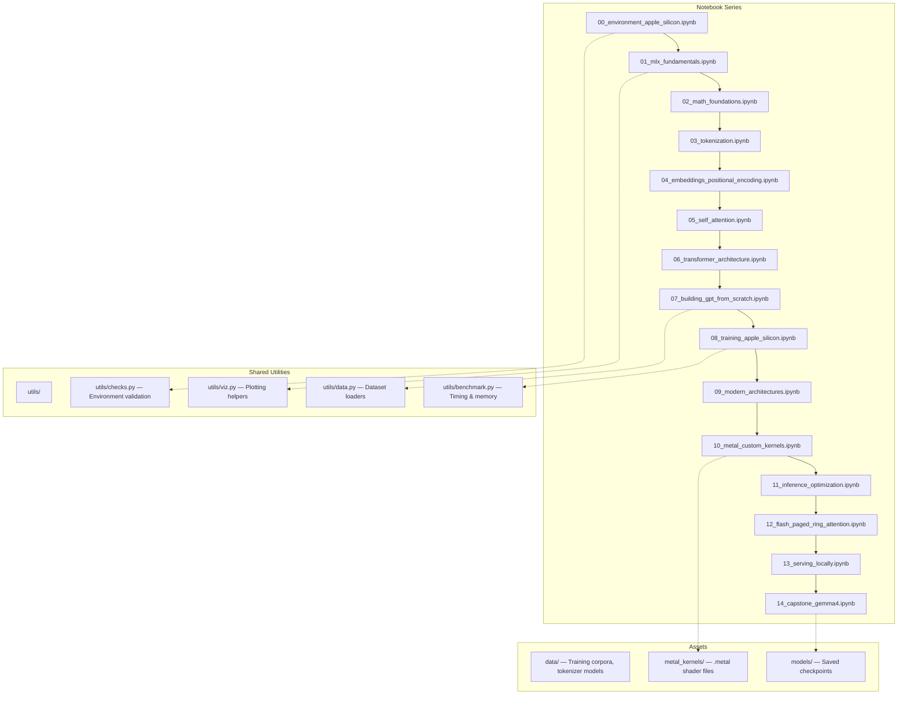
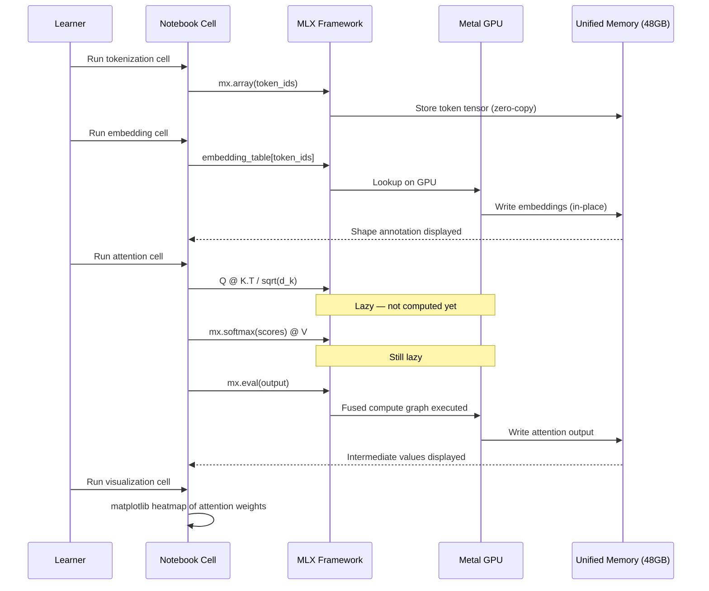
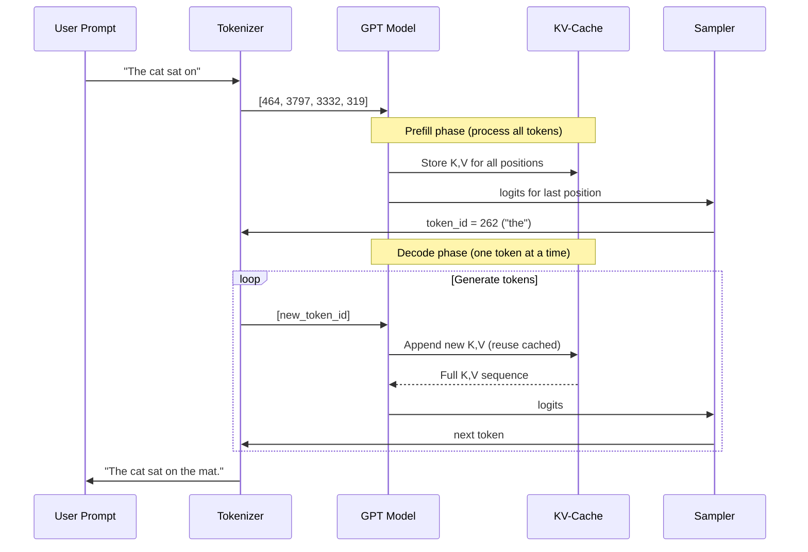

# Design Document: LLM Learning Notebook

## Overview

This project creates a comprehensive, pedagogical series of Jupyter notebooks that teach Large Language Models (LLMs) from absolute scratch, targeting macOS Apple Silicon exclusively. The learning resource runs on a MacBook Pro M4 Pro with 48GB unified memory, using Python 3.13, MLX as the primary ML framework, and Metal as the GPU compute API. The notebooks progress from hardware fundamentals through math foundations, tokenization, attention mechanisms, full transformer implementations, modern architectures (LLaMA, Mistral, Gemma), Metal Shading Language custom kernels, inference optimization, and culminate in a capstone that fine-tunes and serves Gemma 4 locally.

The pedagogical design prioritizes step-by-step execution with intermediate outputs in every cell, plain English explanations before every code block, matplotlib visualizations for every concept, and progressive complexity that builds layer by layer. Every formula is decomposed across multiple cells so learners can run each step independently and observe how data transforms. The content targets interview readiness at top AI labs (Google DeepMind, OpenAI, Anthropic, Apple ML, Meta FAIR) with tips, tricks, and mental models woven throughout.

The project restructures the existing partial notebook (`llm_from_scratch.ipynb`, covering Phases 0–3) into a series of focused notebooks organized by topic, each self-contained but building on concepts from prior notebooks. This modular approach prevents any single notebook from becoming unwieldy, allows learners to jump to specific topics, and keeps Jupyter kernel memory manageable within the 48GB constraint.

## Architecture



## Sequence Diagrams

### Main Learning Flow: Building a GPT Token-by-Token



### Training Loop on Apple Silicon

```mermaid
sequenceDiagram
    participant Loop as Training Loop
    participant Model as GPT Model (MLX)
    participant Grad as value_and_grad
    participant Opt as Optimizer (AdamW)
    participant Metal as Metal GPU
    participant Mem as Unified Memory

    Loop->>Model: Forward pass (lazy)
    Model->>Grad: Compute loss + gradients (lazy)
    Grad->>Opt: optimizer.update(model, grads)
    Opt->>Metal: mx.eval(model.parameters(), optimizer.state)
    Metal->>Mem: Update weights in-place
    Mem-->>Loop: Loss value for logging
    
    Note over Loop,Mem: Every N steps
    Loop->>Mem: Check mx.metal.get_active_memory()
    Loop->>Loop: Log loss, perplexity, tok/s, memory
```

### Inference with KV-Cache



## Components and Interfaces

### Component 1: Notebook Cell Pattern

**Purpose**: Standardized cell structure ensuring every concept follows the pedagogical pattern.

**Interface**:
```python
class NotebookCellPattern:
    """Every concept in the notebook follows this pattern."""
    
    def markdown_explanation(self) -> str:
        """Plain English explanation BEFORE the code cell.
        - What we're about to do and why
        - The formula/concept in LaTeX
        - Shape annotations for tensor operations
        """
        ...
    
    def code_implementation(self) -> str:
        """Step-by-step code with intermediate outputs.
        - Each sub-step in its own print() or display()
        - Shape printed after every tensor operation
        - Comments explaining every non-obvious line
        """
        ...
    
    def visualization(self) -> str:
        """matplotlib/seaborn plot showing the result.
        - Heatmaps for attention weights
        - Line plots for loss curves
        - Bar charts for probability distributions
        """
        ...
    
    def tips_and_tricks(self) -> str:
        """Interview tips, performance tricks, debugging hacks.
        - 💡 for insights
        - ⚡ for performance tips
        - 🎯 for interview tips
        - ⚠️ for common pitfalls
        """
        ...
```

**Responsibilities**:
- Enforce consistent pedagogical structure across all 15 notebooks
- Ensure every formula is broken into multiple executable cells
- Guarantee every cell produces visible output

### Component 2: MLX Model Building Blocks

**Purpose**: Reusable neural network components built progressively across notebooks.

**Interface**:
```python
class TokenEmbedding(nn.Module):
    """Notebook 04: Token + positional embedding layer."""
    def __init__(self, vocab_size: int, d_model: int, max_seq_len: int, use_rope: bool = False): ...
    def __call__(self, token_ids: mx.array) -> mx.array: ...

class MultiHeadAttention(nn.Module):
    """Notebook 05-06: Multi-head self-attention with optional mask."""
    def __init__(self, d_model: int, n_heads: int, use_flash: bool = False): ...
    def __call__(self, x: mx.array, mask: mx.array | None = None) -> mx.array: ...

class TransformerBlock(nn.Module):
    """Notebook 06: Single transformer block (attention + FFN + norms)."""
    def __init__(self, d_model: int, n_heads: int, d_ff: int, norm_type: str = "rmsnorm"): ...
    def __call__(self, x: mx.array, mask: mx.array | None = None) -> mx.array: ...

class GPTModel(nn.Module):
    """Notebook 07: Full GPT model assembled from blocks."""
    def __init__(self, vocab_size: int, d_model: int, n_heads: int, n_layers: int, 
                 d_ff: int, max_seq_len: int): ...
    def __call__(self, token_ids: mx.array) -> mx.array: ...
    def generate(self, prompt_ids: mx.array, max_tokens: int, temperature: float = 1.0,
                 top_k: int | None = None, top_p: float | None = None) -> mx.array: ...
```

**Responsibilities**:
- Each component is first built from scratch (raw MLX ops), then refactored using `mlx.nn`
- Shape annotations printed at every layer boundary
- Components compose into the full GPT model

### Component 3: Training Infrastructure

**Purpose**: Training loop, data loading, and memory management for Apple Silicon.

**Interface**:
```python
class TextDataset:
    """Loads and tokenizes text data for training."""
    def __init__(self, text: str, tokenizer, seq_len: int): ...
    def __iter__(self) -> Iterator[tuple[mx.array, mx.array]]: ...
    def __len__(self) -> int: ...

class Trainer:
    """MLX training loop with Apple Silicon optimizations."""
    def __init__(self, model: nn.Module, optimizer: optim.Optimizer,
                 loss_fn: Callable, max_memory_gb: float = 40.0): ...
    def train_epoch(self, dataset: TextDataset, batch_size: int) -> dict: ...
    def evaluate(self, dataset: TextDataset, batch_size: int) -> dict: ...
    def log_metrics(self, step: int, metrics: dict) -> None: ...
    def check_memory(self) -> dict: ...

class MemoryMonitor:
    """Tracks unified memory usage during training/inference."""
    def __init__(self, budget_gb: float = 48.0): ...
    def snapshot(self) -> dict: ...
    def estimate_model_memory(self, model: nn.Module, dtype: mx.Dtype) -> float: ...
    def estimate_kv_cache(self, n_layers: int, d_model: int, max_seq: int, 
                          dtype: mx.Dtype) -> float: ...
```

**Responsibilities**:
- Batch data loading with proper sequence packing
- Memory-aware training that stays within 48GB budget
- Metrics logging (loss, perplexity, tokens/sec, memory usage)
- Gradient accumulation for effective larger batch sizes

### Component 4: Inference Engine

**Purpose**: Optimized inference with KV-cache, quantization, and sampling strategies.

**Interface**:
```python
class KVCache:
    """Key-Value cache for autoregressive generation."""
    def __init__(self, n_layers: int, n_heads: int, d_head: int, max_seq: int): ...
    def update(self, layer: int, new_k: mx.array, new_v: mx.array) -> tuple[mx.array, mx.array]: ...
    def memory_usage_bytes(self) -> int: ...

class Quantizer:
    """Post-training quantization for Apple Silicon deployment."""
    def quantize_model(self, model: nn.Module, bits: int = 4, 
                       group_size: int = 64) -> nn.Module: ...
    def measure_perplexity_delta(self, original: nn.Module, quantized: nn.Module,
                                  eval_data: TextDataset) -> float: ...

class TextGenerator:
    """Complete text generation pipeline with sampling."""
    def __init__(self, model: nn.Module, tokenizer, use_kv_cache: bool = True): ...
    def generate(self, prompt: str, max_tokens: int = 256,
                 temperature: float = 0.7, top_k: int = 50,
                 top_p: float = 0.9) -> str: ...
    def stream_generate(self, prompt: str, max_tokens: int = 256) -> Iterator[str]: ...
```

**Responsibilities**:
- KV-cache management with memory budgeting
- 4-bit and 8-bit quantization using MLX's quantization support
- Multiple sampling strategies (greedy, top-k, top-p, temperature)
- Streaming token generation

### Component 5: Metal Kernel Interface

**Purpose**: Custom Metal Shading Language kernels for ML operations.

**Interface**:
```python
class MetalKernel:
    """Interface for custom Metal compute shaders."""
    def __init__(self, source_path: str, function_name: str): ...
    def __call__(self, *inputs: mx.array, grid: tuple, threadgroup: tuple) -> mx.array: ...

# Example kernels to implement:
# metal_kernels/softmax.metal — Custom fused softmax
# metal_kernels/rope.metal — Rotary position embedding
# metal_kernels/rmsnorm.metal — RMS normalization
# metal_kernels/matmul_tiled.metal — Tiled matrix multiply
```

**Responsibilities**:
- Demonstrate Metal compute shader authoring for ML
- Show SIMD group operations and threadgroup shared memory
- Compare custom kernel performance against MLX built-ins

## Data Models

### Model 1: Notebook Metadata

```python
@dataclass
class NotebookConfig:
    """Configuration for each notebook in the series."""
    notebook_id: int          # 0-14
    title: str                # e.g., "Self-Attention from Scratch"
    filename: str             # e.g., "05_self_attention.ipynb"
    prerequisites: list[int]  # Notebook IDs that must be completed first
    estimated_time_min: int   # Estimated completion time
    memory_peak_gb: float     # Peak memory usage during execution
    gpu_required: bool        # Whether Metal GPU is needed
    dependencies: list[str]   # pip packages needed beyond base
```

**Validation Rules**:
- `notebook_id` must be in range [0, 14]
- `memory_peak_gb` must not exceed 45.0 (leave headroom from 48GB)
- `prerequisites` must only reference notebooks with lower IDs
- `filename` must match pattern `{nn}_{snake_case}.ipynb`

### Model 2: Training Configuration

```python
@dataclass
class TrainingConfig:
    """Configuration for GPT training runs."""
    # Model architecture
    vocab_size: int = 50257
    d_model: int = 384
    n_heads: int = 6
    n_layers: int = 6
    d_ff: int = 1536          # 4 * d_model
    max_seq_len: int = 256
    dropout: float = 0.1
    
    # Training
    batch_size: int = 32
    learning_rate: float = 3e-4
    weight_decay: float = 0.1
    warmup_steps: int = 100
    max_steps: int = 5000
    grad_accum_steps: int = 1
    
    # Apple Silicon specific
    dtype: str = "float16"    # float16 or bfloat16
    max_memory_gb: float = 40.0
    eval_interval: int = 250
    
    # Data
    dataset_name: str = "tiny_shakespeare"
    tokenizer_type: str = "character"  # character | bpe | tiktoken
```

**Validation Rules**:
- `d_model` must be divisible by `n_heads`
- `d_ff` should be 4 * `d_model` (standard) or configurable
- `batch_size * max_seq_len * d_model * 4` (bytes for float32 grads) must fit in `max_memory_gb`
- `dtype` must be one of `["float16", "bfloat16", "float32"]`

### Model 3: Memory Budget

```python
@dataclass  
class MemoryBudget:
    """Memory allocation plan for 48GB unified memory."""
    total_gb: float = 48.0
    os_reserved_gb: float = 4.0       # macOS + apps
    model_weights_gb: float = 0.0     # Depends on model size + dtype
    optimizer_state_gb: float = 0.0   # ~2x model weights for Adam
    activations_gb: float = 0.0       # Depends on batch_size * seq_len
    kv_cache_gb: float = 0.0          # For inference
    data_buffer_gb: float = 1.0       # Dataset in memory
    headroom_gb: float = 3.0          # Safety margin
    
    @property
    def available_gb(self) -> float:
        return self.total_gb - self.os_reserved_gb - self.headroom_gb
    
    @property
    def used_gb(self) -> float:
        return (self.model_weights_gb + self.optimizer_state_gb + 
                self.activations_gb + self.kv_cache_gb + self.data_buffer_gb)
    
    def fits(self) -> bool:
        return self.used_gb <= self.available_gb
```

**Validation Rules**:
- `used_gb` must not exceed `available_gb`
- `model_weights_gb` calculated as: `n_params * bytes_per_param / 1e9`
- `optimizer_state_gb` for Adam: `~2 * model_weights_gb` (first + second moments)
- `kv_cache_gb` calculated as: `2 * n_layers * max_seq * d_model * bytes_per_param / 1e9`

## Algorithmic Pseudocode

### Main Algorithm: Scaled Dot-Product Attention

```python
def scaled_dot_product_attention(Q: mx.array, K: mx.array, V: mx.array, 
                                  mask: mx.array | None = None) -> mx.array:
    """
    Core attention mechanism — the heart of every transformer.
    
    Q: (batch, n_heads, seq_len, d_head) — queries
    K: (batch, n_heads, seq_len, d_head) — keys  
    V: (batch, n_heads, seq_len, d_head) — values
    mask: (seq_len, seq_len) — causal mask (optional)
    
    Returns: (batch, n_heads, seq_len, d_head) — attended values
    """
    d_k = Q.shape[-1]
    
    # Step 1: Compute attention scores
    # Q @ K^T gives (seq_len, seq_len) similarity matrix
    scores = Q @ K.transpose(0, 1, 3, 2)  # (..., seq, d) @ (..., d, seq) -> (..., seq, seq)
    
    # Step 2: Scale by sqrt(d_k) to prevent softmax saturation
    scores = scores / mx.sqrt(mx.array(d_k, dtype=scores.dtype))
    
    # Step 3: Apply causal mask (prevent attending to future tokens)
    if mask is not None:
        scores = mx.where(mask == 0, mx.array(float('-inf')), scores)
    
    # Step 4: Softmax to get attention weights (rows sum to 1)
    weights = mx.softmax(scores, axis=-1)
    
    # Step 5: Weighted sum of values
    output = weights @ V  # (..., seq, seq) @ (..., seq, d) -> (..., seq, d)
    
    return output
```

**Preconditions:**
- `Q`, `K`, `V` have matching batch and n_heads dimensions
- `Q.shape[-1] == K.shape[-1]` (d_head must match for dot product)
- `K.shape[-2] == V.shape[-2]` (sequence lengths must match)
- `d_k > 0` (non-zero head dimension)
- If `mask` provided: shape is broadcastable to `(seq_len, seq_len)`

**Postconditions:**
- Output shape equals `Q.shape` (same batch, heads, seq_len, d_head)
- Attention weights sum to 1.0 along last axis (within floating-point tolerance)
- If causal mask applied: no information flows from future positions
- Output values are bounded by the range of values in `V`

**Loop Invariants:** N/A (no explicit loops; operations are batched matrix multiplies)

### Algorithm: Rotary Position Embedding (RoPE)

```python
def apply_rope(x: mx.array, freqs_cis: mx.array) -> mx.array:
    """
    Apply Rotary Position Embeddings to queries or keys.
    
    x: (batch, seq_len, n_heads, d_head) — input tensor
    freqs_cis: (seq_len, d_head // 2, 2) — precomputed rotation frequencies
    
    Returns: (batch, seq_len, n_heads, d_head) — rotated tensor
    """
    # Step 1: Reshape x into pairs of dimensions for rotation
    # Each pair (x_i, x_{i+1}) gets rotated by angle theta_i * position
    d_head = x.shape[-1]
    x_pairs = x.reshape(*x.shape[:-1], d_head // 2, 2)  # (..., d_head//2, 2)
    
    # Step 2: Extract cos and sin components from precomputed frequencies
    cos_theta = freqs_cis[..., 0]  # (seq_len, d_head//2)
    sin_theta = freqs_cis[..., 1]  # (seq_len, d_head//2)
    
    # Step 3: Apply 2D rotation to each pair
    # [cos θ, -sin θ] [x_0]   [x_0 cos θ - x_1 sin θ]
    # [sin θ,  cos θ] [x_1] = [x_0 sin θ + x_1 cos θ]
    x_0 = x_pairs[..., 0]
    x_1 = x_pairs[..., 1]
    
    rotated_0 = x_0 * cos_theta - x_1 * sin_theta
    rotated_1 = x_0 * sin_theta + x_1 * cos_theta
    
    # Step 4: Reassemble into original shape
    rotated = mx.stack([rotated_0, rotated_1], axis=-1)
    return rotated.reshape(x.shape)
```

**Preconditions:**
- `x.shape[-1]` (d_head) must be even (pairs of dimensions)
- `freqs_cis.shape[0] >= x.shape[1]` (frequencies cover all positions)
- `freqs_cis.shape[1] == x.shape[-1] // 2` (one frequency per pair)

**Postconditions:**
- Output shape equals input shape
- L2 norm of each head vector is preserved (rotation is norm-preserving)
- Relative position information is encoded: `dot(RoPE(q, pos_i), RoPE(k, pos_j))` depends only on `pos_i - pos_j`

**Loop Invariants:** N/A (vectorized operation)

### Algorithm: BPE Tokenizer Training

```python
def train_bpe(corpus: str, vocab_size: int) -> tuple[dict, list]:
    """
    Train a Byte-Pair Encoding tokenizer from scratch.
    
    corpus: raw text to learn vocabulary from
    vocab_size: target vocabulary size
    
    Returns: (vocab: dict[str, int], merges: list[tuple[str, str]])
    """
    # Step 1: Initialize with character-level tokens
    tokens = list(corpus.encode("utf-8"))  # Start with bytes
    vocab = {bytes([i]): i for i in range(256)}  # 256 byte tokens
    merges = []
    next_id = 256
    
    num_merges = vocab_size - 256
    
    # Step 2: Iteratively merge most frequent adjacent pair
    for step in range(num_merges):
        # INVARIANT: len(vocab) == 256 + step
        # INVARIANT: all tokens in `tokens` are valid vocab entries
        
        # Count all adjacent pairs
        pair_counts = {}
        for i in range(len(tokens) - 1):
            pair = (tokens[i], tokens[i + 1])
            pair_counts[pair] = pair_counts.get(pair, 0) + 1
        
        if not pair_counts:
            break  # No more pairs to merge
        
        # Find the most frequent pair
        best_pair = max(pair_counts, key=pair_counts.get)
        
        # Create new token for this pair
        vocab[best_pair] = next_id
        merges.append(best_pair)
        
        # Replace all occurrences of best_pair in tokens
        new_tokens = []
        i = 0
        while i < len(tokens):
            if i < len(tokens) - 1 and (tokens[i], tokens[i + 1]) == best_pair:
                new_tokens.append(next_id)
                i += 2
            else:
                new_tokens.append(tokens[i])
                i += 1
        tokens = new_tokens
        next_id += 1
    
    return vocab, merges
```

**Preconditions:**
- `corpus` is a non-empty string
- `vocab_size > 256` (must exceed base byte vocabulary)

**Postconditions:**
- `len(vocab) <= vocab_size`
- `len(merges) == len(vocab) - 256`
- Encoding then decoding any substring of `corpus` reproduces the original text
- Merges are ordered by frequency (most frequent first)

**Loop Invariants:**
- `len(vocab) == 256 + step` at the start of each iteration
- All elements in `tokens` are valid keys in `vocab`
- `len(tokens)` strictly decreases with each merge (at least one pair replaced)
- `next_id == 256 + step + 1` after each merge

### Algorithm: GPT Training Step

```python
def training_step(model: nn.Module, optimizer: optim.Optimizer,
                  batch_x: mx.array, batch_y: mx.array,
                  loss_and_grad_fn: Callable) -> dict:
    """
    Single training step for GPT model on Apple Silicon.
    
    model: GPT model (nn.Module)
    optimizer: AdamW optimizer
    batch_x: (batch, seq_len) input token IDs
    batch_y: (batch, seq_len) target token IDs (shifted by 1)
    loss_and_grad_fn: nn.value_and_grad(model, loss_fn)
    
    Returns: dict with loss, perplexity, tokens_per_sec
    """
    import time
    
    t0 = time.perf_counter()
    num_tokens = batch_x.shape[0] * batch_x.shape[1]
    
    # Step 1: Forward pass + backward pass (both lazy)
    loss, grads = loss_and_grad_fn(model, batch_x, batch_y)
    
    # Step 2: Update parameters
    optimizer.update(model, grads)
    
    # Step 3: Force evaluation (triggers Metal GPU compute)
    mx.eval(model.parameters(), optimizer.state, loss)
    
    t1 = time.perf_counter()
    
    # Step 4: Compute metrics
    loss_val = loss.item()
    return {
        "loss": loss_val,
        "perplexity": math.exp(loss_val),
        "tokens_per_sec": num_tokens / (t1 - t0),
        "step_time_ms": (t1 - t0) * 1000,
        "memory_gb": mx.metal.get_active_memory() / 1e9,
    }
```

**Preconditions:**
- `batch_x.shape == batch_y.shape`
- `batch_x` values in range `[0, vocab_size)`
- `batch_y[i, j] == batch_x[i, j+1]` (next-token prediction)
- Model and optimizer are on the same device (unified memory — always true on Apple Silicon)

**Postconditions:**
- Model parameters updated by one gradient step
- Returned loss is a finite positive number
- `memory_gb` does not exceed configured budget
- Optimizer state (Adam moments) updated

**Loop Invariants:** (when called in a training loop)
- Model parameters remain finite (no NaN/Inf)
- Learning rate follows warmup + cosine decay schedule
- Memory usage stays within 48GB budget

## Key Functions with Formal Specifications


### Function 1: create_causal_mask()

```python
def create_causal_mask(seq_len: int) -> mx.array:
    """Create lower-triangular causal mask for autoregressive attention."""
    mask = mx.tril(mx.ones((seq_len, seq_len)))
    return mask
```

**Preconditions:**
- `seq_len > 0`

**Postconditions:**
- Output shape is `(seq_len, seq_len)`
- `mask[i][j] == 1.0` if `j <= i`, else `0.0`
- Mask is lower-triangular: `mask == mx.tril(mask)`

**Loop Invariants:** N/A

### Function 2: cosine_lr_schedule()

```python
def cosine_lr_schedule(step: int, max_steps: int, max_lr: float, 
                       min_lr: float, warmup_steps: int) -> float:
    """Cosine learning rate schedule with linear warmup."""
    if step < warmup_steps:
        return max_lr * (step / warmup_steps)
    if step >= max_steps:
        return min_lr
    progress = (step - warmup_steps) / (max_steps - warmup_steps)
    return min_lr + 0.5 * (max_lr - min_lr) * (1 + math.cos(math.pi * progress))
```

**Preconditions:**
- `0 <= step`
- `max_steps > warmup_steps > 0`
- `max_lr > min_lr > 0`

**Postconditions:**
- Return value is in range `[min_lr, max_lr]`
- During warmup (`step < warmup_steps`): linearly increases from 0 to `max_lr`
- After warmup: follows cosine decay from `max_lr` to `min_lr`
- At `step >= max_steps`: returns `min_lr`

**Loop Invariants:** N/A (pure function)

### Function 3: estimate_model_flops()

```python
def estimate_model_flops(n_params: int, seq_len: int, batch_size: int) -> dict:
    """Estimate FLOPs for forward + backward pass (Kaplan scaling law approximation)."""
    forward_flops = 2 * n_params * seq_len * batch_size
    backward_flops = 2 * forward_flops  # ~2x forward for backward
    total_flops = forward_flops + backward_flops
    return {
        "forward_flops": forward_flops,
        "backward_flops": backward_flops,
        "total_flops": total_flops,
        "total_tflops": total_flops / 1e12,
    }
```

**Preconditions:**
- `n_params > 0`, `seq_len > 0`, `batch_size > 0`

**Postconditions:**
- `total_flops == 3 * forward_flops` (standard approximation)
- `forward_flops == 2 * n_params * seq_len * batch_size`
- All returned values are positive

**Loop Invariants:** N/A (pure function)

### Function 4: quantize_weights()

```python
def quantize_weights(weights: mx.array, bits: int = 4, 
                     group_size: int = 64) -> tuple[mx.array, mx.array, mx.array]:
    """Quantize float16 weights to N-bit integers with group-wise scaling."""
    assert bits in (4, 8), "Only 4-bit and 8-bit quantization supported"
    
    # Reshape into groups
    orig_shape = weights.shape
    flat = weights.reshape(-1, group_size)
    
    # Compute per-group scale and zero-point
    w_min = flat.min(axis=-1, keepdims=True)
    w_max = flat.max(axis=-1, keepdims=True)
    n_levels = 2 ** bits - 1
    scale = (w_max - w_min) / n_levels
    zero_point = w_min
    
    # Quantize
    quantized = mx.round((flat - zero_point) / scale).astype(mx.uint8)
    
    return quantized, scale, zero_point
```

**Preconditions:**
- `weights.dtype` is `float16` or `bfloat16`
- `weights` total elements is divisible by `group_size`
- `bits` is 4 or 8

**Postconditions:**
- `quantized` values in range `[0, 2^bits - 1]`
- Dequantized values approximate original: `max_error < (w_max - w_min) / (2^bits)`
- Memory reduction: `bits / 16` of original size (plus small overhead for scales)

**Loop Invariants:** N/A

## Example Usage

### Example 1: Building and Training a Tiny GPT

```python
import mlx.core as mx
import mlx.nn as nn
import mlx.optimizers as optim

# Configure a small GPT for learning (fits easily in 48GB)
config = TrainingConfig(
    vocab_size=256,       # Character-level for simplicity
    d_model=128,
    n_heads=4,
    n_layers=4,
    d_ff=512,
    max_seq_len=128,
    batch_size=16,
    learning_rate=3e-4,
    max_steps=1000,
)

# Build model
model = GPTModel(
    vocab_size=config.vocab_size,
    d_model=config.d_model,
    n_heads=config.n_heads,
    n_layers=config.n_layers,
    d_ff=config.d_ff,
    max_seq_len=config.max_seq_len,
)

# Count parameters
n_params = sum(p.size for p in model.parameters().values())
print(f"Model parameters: {n_params:,}")
print(f"Model size (fp16): {n_params * 2 / 1e6:.1f} MB")

# Setup training
optimizer = optim.AdamW(learning_rate=config.learning_rate, weight_decay=0.1)

def loss_fn(model, x, y):
    logits = model(x)  # (batch, seq_len, vocab_size)
    return nn.losses.cross_entropy(logits, y, reduction="mean")

loss_and_grad_fn = nn.value_and_grad(model, loss_fn)

# Training loop
for step in range(config.max_steps):
    batch_x, batch_y = dataset.get_batch(config.batch_size)
    metrics = training_step(model, optimizer, batch_x, batch_y, loss_and_grad_fn)
    
    if step % 100 == 0:
        print(f"Step {step}: loss={metrics['loss']:.4f}, "
              f"ppl={metrics['perplexity']:.1f}, "
              f"tok/s={metrics['tokens_per_sec']:.0f}, "
              f"mem={metrics['memory_gb']:.1f}GB")
```

### Example 2: Running Inference with KV-Cache

```python
# After training, generate text with KV-cache for efficiency
generator = TextGenerator(model, tokenizer, use_kv_cache=True)

prompt = "The meaning of life is"
output = generator.generate(
    prompt=prompt,
    max_tokens=100,
    temperature=0.8,
    top_p=0.9,
)
print(f"Prompt: {prompt}")
print(f"Generated: {output}")

# Streaming generation
print("\nStreaming: ", end="")
for token in generator.stream_generate(prompt, max_tokens=50):
    print(token, end="", flush=True)
print()
```

### Example 3: Custom Metal Kernel

```python
# Load and run a custom Metal softmax kernel
import mlx.core as mx

# The Metal kernel source (simplified)
metal_source = """
#include <metal_stdlib>
using namespace metal;

kernel void softmax_kernel(
    device const float* input [[buffer(0)]],
    device float* output [[buffer(1)]],
    constant uint& N [[buffer(2)]],
    uint tid [[thread_position_in_grid]]
) {
    // Find max for numerical stability
    float max_val = -INFINITY;
    for (uint i = 0; i < N; i++) {
        max_val = max(max_val, input[tid * N + i]);
    }
    
    // Compute exp and sum
    float sum = 0.0;
    for (uint i = 0; i < N; i++) {
        output[tid * N + i] = exp(input[tid * N + i] - max_val);
        sum += output[tid * N + i];
    }
    
    // Normalize
    for (uint i = 0; i < N; i++) {
        output[tid * N + i] /= sum;
    }
}
"""

# Compare with MLX built-in
x = mx.random.normal((32, 128))
result_mlx = mx.softmax(x, axis=-1)
mx.eval(result_mlx)
print(f"MLX softmax output shape: {result_mlx.shape}")
print(f"Row sums (should be 1.0): {result_mlx.sum(axis=-1)[:5]}")
```

## Correctness Properties

The following properties must hold across the notebook implementations:

1. **Attention weight normalization**: For all attention computations, `mx.sum(attention_weights, axis=-1)` equals 1.0 within floating-point tolerance (±1e-5 for float16, ±1e-7 for float32).

2. **Causal mask correctness**: For all positions `i` in a generated sequence, the model's attention at position `i` has zero weight on all positions `j > i`. Formally: `∀i, ∀j > i: attention_weights[i][j] == 0.0`.

3. **Tokenizer roundtrip**: For all strings `s` in the training corpus, `decode(encode(s)) == s`. The tokenizer must be lossless.

4. **RoPE norm preservation**: For all input vectors `x`, `||RoPE(x, pos)|| == ||x||` within floating-point tolerance. Rotation preserves vector magnitude.

5. **Softmax numerical stability**: For all input logits (including extreme values up to ±1000), the softmax implementation produces valid probabilities (no NaN, no Inf, all values in [0, 1], sum to 1.0).

6. **Memory budget compliance**: For all training configurations, `actual_memory_usage <= MemoryBudget.available_gb`. No operation exceeds the 48GB unified memory limit.

7. **Quantization bounded error**: For all weight tensors quantized to N bits with group size G, the maximum absolute error per group is bounded by `(max_val - min_val) / (2^N - 1)`.

8. **KV-cache equivalence**: For all sequences, generation with KV-cache produces identical logits to generation without KV-cache (full recomputation). Formally: `∀seq: logits_with_cache(seq) == logits_without_cache(seq)`.

9. **Loss monotonicity (statistical)**: Over a training run of sufficient length (>100 steps), the exponential moving average of training loss is non-increasing with high probability.

10. **Gradient finite check**: For all training steps, all gradient values are finite: `∀g ∈ gradients: isfinite(g) == True`.

## Error Handling

### Error Scenario 1: Out of Memory During Training

**Condition**: `mx.metal.get_active_memory()` exceeds 90% of 48GB during a training step, or Metal allocation fails.
**Response**: Catch the exception, log current memory state, reduce batch size by half, and retry. Display a clear message showing memory breakdown (model weights, optimizer state, activations, KV-cache).
**Recovery**: Automatic batch size reduction with gradient accumulation to maintain effective batch size. If still OOM at batch_size=1, suggest reducing `max_seq_len` or `d_model`.

### Error Scenario 2: NaN/Inf in Loss

**Condition**: `math.isnan(loss)` or `math.isinf(loss)` during training.
**Response**: Stop training, log the step number and last 10 loss values. Check for: learning rate too high, missing gradient clipping, numerical overflow in attention scores.
**Recovery**: Reduce learning rate by 10x, enable gradient clipping (`max_norm=1.0`), switch to bfloat16 (better dynamic range than float16). Restart from last checkpoint.

### Error Scenario 3: MLX Metal Not Available

**Condition**: `mx.metal.is_available()` returns `False`.
**Response**: Display diagnostic information (macOS version, chip type, MLX version). Warn that all computation will fall back to CPU, which will be significantly slower.
**Recovery**: Suggest updating macOS and MLX. Provide CPU-only fallback path for all notebooks (slower but functional).

### Error Scenario 4: Dependency Version Conflict

**Condition**: Import fails for MLX, tiktoken, or other dependencies due to Python 3.13 incompatibility.
**Response**: Display the exact error, the installed version, and the required version. Provide the exact pip command to fix.
**Recovery**: Each notebook starts with a validation cell that checks all required imports and versions before proceeding.

### Error Scenario 5: Model Checkpoint Corruption

**Condition**: Loading a saved model checkpoint fails (file corrupted, shape mismatch, missing keys).
**Response**: Log which keys are missing/mismatched, show expected vs actual shapes.
**Recovery**: Fall back to the most recent valid checkpoint. If none available, reinitialize model and restart training from scratch with a warning.

## Testing Strategy

### Unit Testing Approach

Each notebook includes inline validation cells that serve as unit tests:

- **Shape assertions**: After every tensor operation, assert expected shapes
  ```python
  output = attention(Q, K, V, mask)
  assert output.shape == (batch, n_heads, seq_len, d_head), f"Expected (..., {d_head}), got {output.shape}"
  ```
- **Value range checks**: Verify outputs are in expected ranges
  ```python
  probs = mx.softmax(logits, axis=-1)
  assert mx.all(probs >= 0).item() and mx.all(probs <= 1).item()
  assert abs(probs.sum(axis=-1).item() - 1.0) < 1e-5
  ```
- **Gradient checks**: Verify gradients are finite and reasonable
  ```python
  grads = mx.grad(loss_fn)(params)
  for name, g in grads.items():
      assert mx.all(mx.isfinite(g)).item(), f"Non-finite gradient in {name}"
  ```

### Property-Based Testing Approach

**Property Test Library**: hypothesis (Python)

Key properties to test with random inputs:

1. **Softmax invariants**: For random logits, softmax outputs are valid probabilities
2. **Tokenizer roundtrip**: For random strings, encode→decode is identity
3. **Attention mask**: For random sequences, causal attention never attends to future
4. **RoPE norm**: For random vectors and positions, RoPE preserves L2 norm
5. **Quantize-dequantize**: For random weights, error is bounded by theoretical maximum

### Integration Testing Approach

- **End-to-end training smoke test**: Train tiny GPT (2 layers, d_model=32) for 10 steps, verify loss decreases
- **Generation coherence**: After training on known text, verify generated text contains learned patterns
- **Memory budget test**: Run full training config and verify peak memory stays under 45GB
- **Notebook execution test**: Each notebook can be run top-to-bottom with `jupyter nbconvert --execute` without errors

## Performance Considerations

### Memory Bandwidth Optimization
- LLM inference is memory-bandwidth-bound on Apple Silicon (273 GB/s on M4 Pro)
- Theoretical token generation rate: `bandwidth / model_size_bytes`
- 4-bit quantization gives ~4x speedup over float16 for inference
- KV-cache trades memory for compute: avoids recomputing attention for past tokens

### MLX-Specific Optimizations
- **Lazy evaluation**: Batch operations before `mx.eval()` to enable kernel fusion
- **mx.compile()**: JIT-compile hot functions for repeated execution
- **Memory-efficient attention**: Process attention in chunks to reduce peak memory
- **Mixed precision**: Use float16/bfloat16 for forward pass, float32 for loss accumulation

### Training Performance Targets (M4 Pro, 48GB)
| Model Size | Batch Size | Seq Len | Expected tok/s | Memory |
|-----------|-----------|---------|----------------|--------|
| 10M params | 32 | 128 | ~50,000 | ~2 GB |
| 50M params | 16 | 256 | ~15,000 | ~5 GB |
| 124M (GPT-2) | 8 | 512 | ~5,000 | ~12 GB |
| 350M | 4 | 512 | ~2,000 | ~25 GB |

### Inference Performance Targets (4-bit quantized)
| Model | Expected tok/s | Memory |
|-------|---------------|--------|
| 7B (4-bit) | ~50 | ~4 GB |
| 12B (4-bit) | ~30 | ~7 GB |
| 27B (4-bit) | ~15 | ~14 GB |

## Security Considerations

### Model Download Safety
- All model weights downloaded from Hugging Face Hub via `huggingface_hub` library
- Verify model checksums after download
- Use `trust_remote_code=False` by default when loading models
- Warn users about executing untrusted model code

### Data Privacy
- Training data is local text files only (no personal data)
- No telemetry or data collection in notebook code
- Model weights stay on-device (no cloud inference)

### Dependency Security
- Pin all dependency versions in requirements
- Use only well-known, audited packages (MLX, tiktoken, sentencepiece, huggingface_hub)
- No arbitrary code execution from downloaded content

## Dependencies

### Core Framework
- `mlx` >= 0.22.0 — Apple's ML framework for Apple Silicon
- `mlx-lm` >= 0.20.0 — MLX language model utilities (loading, serving)
- `numpy` >= 1.26.0 — Array operations and NumPy interop

### Tokenization
- `tiktoken` >= 0.7.0 — OpenAI's BPE tokenizer (GPT-4 compatible)
- `sentencepiece` >= 0.2.0 — Google's tokenizer (LLaMA/Gemma compatible)

### Visualization
- `matplotlib` >= 3.9.0 — Plotting and visualization
- `seaborn` >= 0.13.0 — Statistical visualization

### Model Hub
- `huggingface_hub` >= 0.25.0 — Download models from Hugging Face
- `transformers` >= 4.45.0 — Tokenizer configs and model loading
- `datasets` >= 3.0.0 — Training datasets

### Inference
- `llama-cpp-python` >= 0.3.0 — llama.cpp with Metal backend

### Utilities
- `einops` >= 0.8.0 — Tensor reshaping operations

### System Requirements
- macOS 14.0+ (Sonoma or later)
- Apple Silicon (M1/M2/M3/M4 family)
- Python 3.13 (in .venv)
- Xcode Command Line Tools (for Metal compiler)
